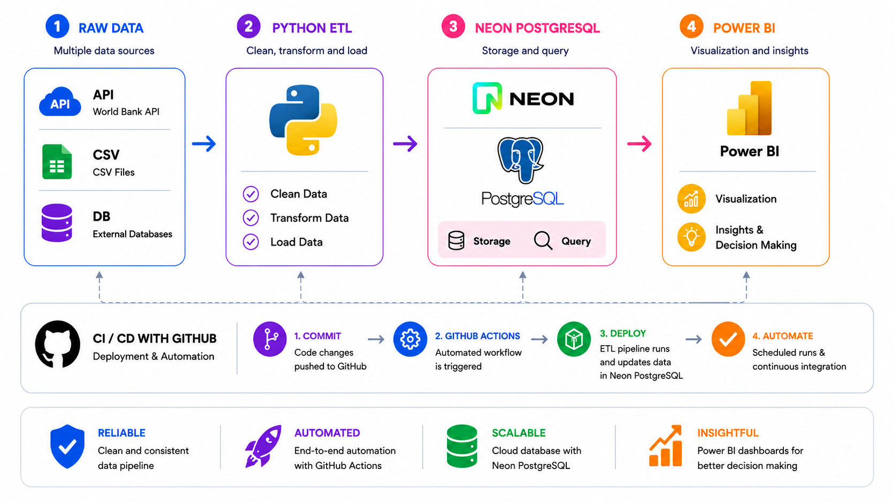
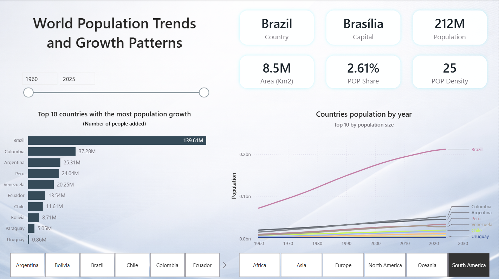
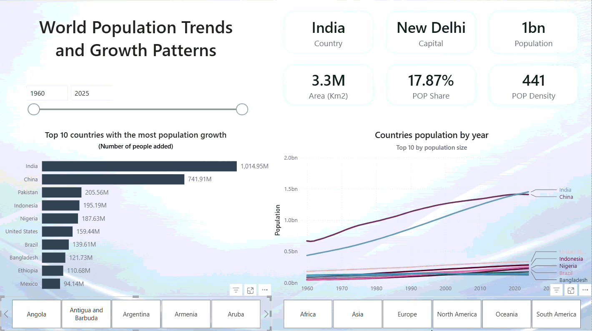
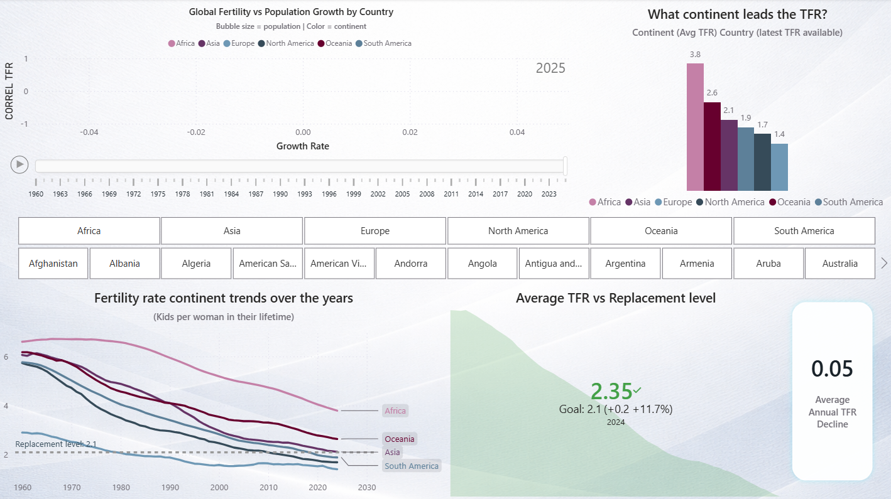
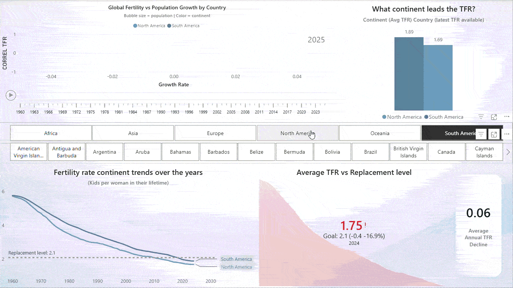
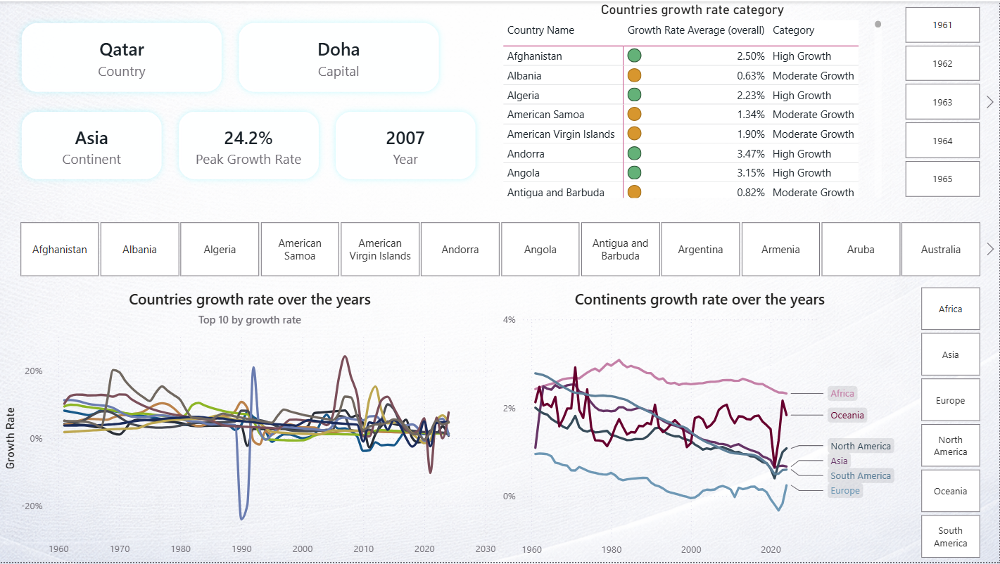
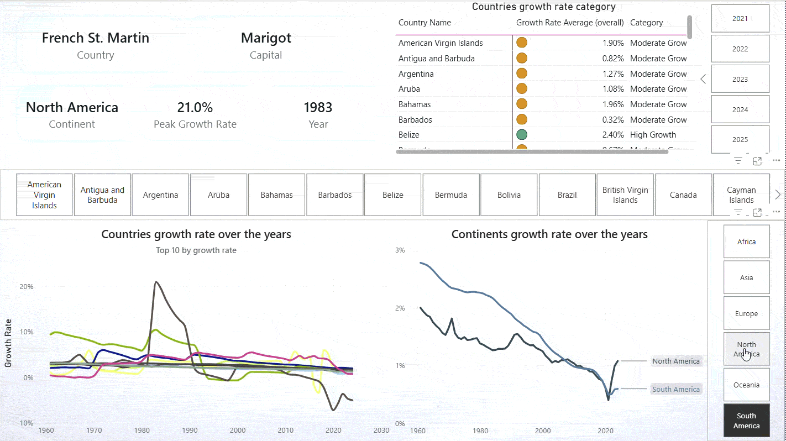
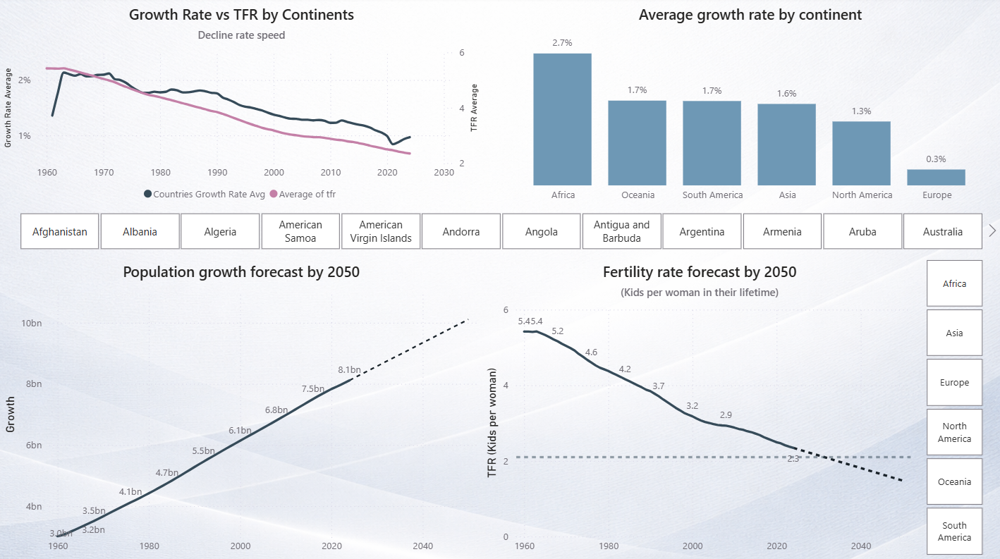
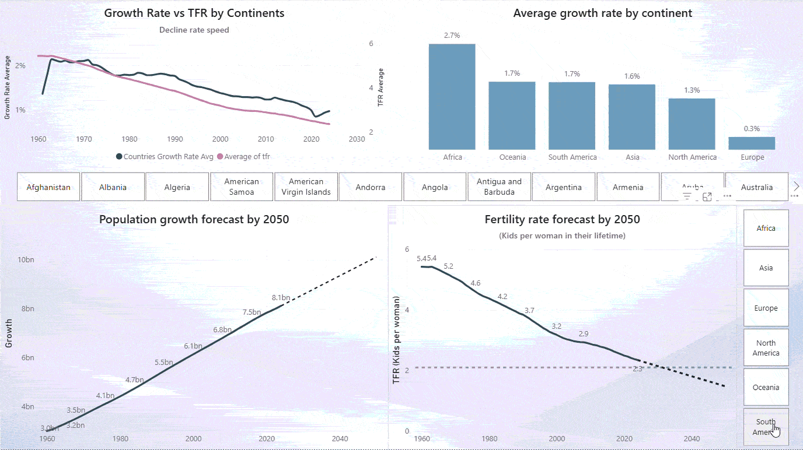

🔤 Idiomas:
[English](README.md) | [Español](README.es.md)

 

# 🌍 Tendencias Demográficas Globales y Tasas de Fertilidad (1960–2050)

 

## Descripción General

Este dashboard ofrece una **visión analítica integral** de la **dinámica poblacional mundial**, el **comportamiento de la fertilidad** y las **proyecciones demográficas a largo plazo** entre continentes desde **1960 hasta 2050**.

Desarrollado en **Power BI** y respaldado por un **pipeline de datos completamente automatizado**, el proyecto transforma datos demográficos complejos en una experiencia analítica de **nivel ejecutivo**, diseñada para proporcionar **perspectivas estratégicas**, **análisis comparativos** y apoyo a la **toma de decisiones orientada al futuro**.

El informe combina **tendencias demográficas históricas** con **modelos de pronóstico**, permitiendo comprender no solo cómo ha evolucionado el crecimiento de la población mundial, sino también los factores demográficos subyacentes que están moldeando los resultados poblacionales del **futuro**.

---

## ⚙️ Arquitectura del Pipeline de Datos End-to-End

Este proyecto fue desarrollado mediante un **pipeline completo de analítica de datos de extremo a extremo (end-to-end)** que automatiza la **recopilación**, el **procesamiento**, el **almacenamiento** y la **visualización** de datos de población mundial.

    

Los datos se extraen desde APIs, archivos CSV y bases de datos, se transforman mediante procesos ETL desarrollados en Python, se almacenan en una base de datos Neon PostgreSQL y posteriormente se analizan a través de dashboards interactivos en Power BI. Todo el flujo de trabajo está automatizado mediante GitHub Actions, permitiendo integración continua, despliegue automatizado y actualizaciones programadas de los datos.

### Componentes Clave

* **Ingeniería de Datos**
* **Procesamiento ETL**
* **Pronóstico Estadístico**
* **Modelado de Bases de Datos Relacionales**
* **Visualización Interactiva de Datos**

---

## 🛠️ Tecnologías Utilizadas

### Fuentes de Datos

* APIs
* Archivos CSV
* Bases de Datos Externas

### Ingeniería de Datos

* Python
* Pandas
* requests
* psycopg2.extras

### Base de Datos

* PostgreSQL
* Neon

### Analítica y Pronósticos

* Power BI
* Modelos Estadísticos de Pronóstico

### Automatización

* GitHub Actions
* Flujos de Trabajo CI/CD

---

## Lo que incluye este Dashboard

### 📈 Análisis del Crecimiento Poblacional

Una visión completa de cómo ha evolucionado la población mundial a lo largo del tiempo, incluyendo:

* Expansión histórica de la población por continente
* Comparación de trayectorias de crecimiento entre continentes
* Distribución de la participación poblacional por región
  

Esto permite identificar rápidamente:

> Regiones de alto crecimiento  
> Poblaciones en desaceleración  
> Cambios demográficos emergentes  
> Tendencias de concentración poblacional a largo plazo  

    
    

Aunque la población mundial alcanzó aproximadamente **8.1 mil millones en 2024**, su crecimiento ha seguido moderándose, con una tasa de expansión que se ha desacelerado de forma sostenida durante las últimas décadas. Esta desaceleración ha sido impulsada principalmente por la caída en la **Tasa Global de Fecundidad (TFR)**, especialmente en economías desarrolladas donde las mujeres están teniendo menos hijos que generaciones anteriores. Como resultado, esta disminución sostenida de la fertilidad está redefiniendo cada vez más los patrones de crecimiento poblacional a largo plazo, la dinámica de la fuerza laboral y la estructura demográfica global.

Para 2024, **India, China, Estados Unidos, Indonesia y Pakistán** se encuentran entre los países más poblados del mundo. Sin embargo, tener una gran población no necesariamente significa experimentar la mayor expansión poblacional a largo plazo. **Nigeria**, por ejemplo, se ubica entre las cinco naciones con mayor crecimiento absoluto de población desde 1960, impulsada principalmente por tasas de fertilidad persistentemente altas, menor mortalidad, mejor supervivencia infantil y una estructura poblacional joven que ha generado un fuerte impulso demográfico.

Este contraste refleja un principio demográfico clave: **tasas de fertilidad más bajas moderan significativamente el crecimiento poblacional con el tiempo, mientras que tasas de fertilidad sostenidamente altas aceleran la expansión poblacional de largo plazo**. Aunque la migración ha tenido un papel importante en el crecimiento poblacional de países como **Estados Unidos**, la rápida expansión demográfica en naciones como **Nigeria** ha sido impulsada principalmente por una alta fertilidad, mayor esperanza de vida y menor mortalidad infantil, destacando el papel dominante de la fertilidad en la trayectoria poblacional.

[Tendencia de la tasa de mortalidad infantil en Nigeria](https://ourworldindata.org/grapher/child-mortality?country=NGA) | [Mejoras de la esperanza de vida en Nigeria](https://ourworldindata.org/grapher/life-expectancy?country=NGA) | [Records de migración dentro de Estados Unidos](https://www.pewresearch.org/short-reads/2024/07/22/how-the-origins-of-americas-immigrants-have-changed-since-1850/)

  

---

### 👶 Insights sobre la Tasa Global de Fecundidad (TFR)

El dashboard ofrece un análisis profundo sobre la **Tasa Global de Fecundidad (TFR)**, uno de los indicadores más sólidos de sostenibilidad demográfica.

Incluye:

* Tendencias históricas de caída en la fertilidad
* Comparación de fertilidad continente por continente
* Posicionamiento actual frente al **nivel de reemplazo (2.1 nacimientos por mujer)**
* Regiones que experimentan una caída acelerada en fertilidad
* Regiones que mantienen fertilidad por encima del nivel de reemplazo   

Esta sección ayuda a responder preguntas clave como:

> ¿Qué continentes están envejeciendo más rápido?  
> ¿Qué poblaciones siguen siendo demográficamente sostenibles?  
> ¿Dónde probablemente se originará el crecimiento poblacional futuro?  

    
    

Las tasas globales de fertilidad promediaban aproximadamente **5.4 hijos por mujer en 1960**, pero desde entonces han entrado en una tendencia sostenida de descenso, cayendo alrededor de **0.05 nacimientos por mujer por año en promedio**. Esta disminución persistente ha desacelerado significativamente el crecimiento poblacional mundial y ha aumentado las preocupaciones sobre desequilibrios demográficos de largo plazo, especialmente el envejecimiento poblacional y la reducción de la fuerza laboral en regiones de baja fertilidad.

Sin embargo, el impacto varía considerablemente entre continentes. Para 2024, **África se mantiene muy por encima del nivel de reemplazo**, con un promedio cercano a **3.85 hijos por mujer**, posicionándose como la región demográficamente más joven y de más rápido crecimiento. En contraste, **Europa** ha reducido su tasa de fertilidad a alrededor de **1.4**, un nivel históricamente bajo muy por debajo del umbral de reemplazo de **2.1**, lo que contribuye a un envejecimiento poblacional acelerado y a la contracción de su fuerza laboral. Mientras tanto, **Norteamérica y Sudamérica** también han caído por debajo del nivel de reemplazo, ubicándose en una trayectoria demográfica similar de menor crecimiento poblacional, mayor edad media y mayores presiones de dependencia.

La caída en la Tasa Global de Fecundidad está impulsada principalmente por el aumento de la educación femenina, la urbanización, un mejor acceso a anticonceptivos, menor mortalidad infantil, maternidad/paternidad más tardía y mayores presiones económicas asociadas con la crianza. En conjunto, estos factores han cambiado las preferencias familiares hacia hogares más pequeños, contribuyendo a un menor crecimiento poblacional y a un envejecimiento acelerado en regiones de baja fertilidad.

**BMC Public Health:**
[La fertilidad humana en relación con la educación, la economía, la religión, la anticoncepción y los programas de planificación familiar](https://link.springer.com/article/10.1186/s12889-020-8331-7)

  

---

### 🔼 Monitoreo de la Tasa de Crecimiento e Indicadores Estratégicos

El módulo de monitoreo de crecimiento e indicadores estratégicos ofrece un análisis detallado sobre las **tasas de crecimiento poblacional**, un indicador demográfico clave utilizado para evaluar **tendencias de expansión poblacional, diferencias regionales de crecimiento y cambios de largo plazo en el impulso demográfico global**.

El dashboard incluye:

* Rendimiento del crecimiento poblacional a nivel país
* Tasa histórica máxima de crecimiento (%) por país
* Clasificación del crecimiento por país (Alto / Moderado / En descenso)
* Tendencias de crecimiento poblacional de largo plazo por país
* Comparaciones continentales de crecimiento poblacional
* Patrones regionales de aceleración / desaceleración del crecimiento
* Cambios temporales en el crecimiento a través de las décadas (1960–2024)   

    
    

Algunos países experimentaron crecimientos poblacionales excepcionales. **Qatar**, por ejemplo, registró una de las tasas máximas de crecimiento más altas de la historia moderna, alcanzando **24.2%** a mediados y finales de la década del 2000. En contraste, otras naciones experimentaron caídas poblacionales históricas. **Kuwait**, por ejemplo, registró una de las caídas más abruptas jamás registradas, alrededor de **-24% en 1990**, impulsada principalmente por la [invasión iraquí a Kuwait](https://www.britannica.com/event/Persian-Gulf-War) y la posterior [Guerra del Golfo](https://en.wikipedia.org/wiki/Gulf_War), eventos que provocaron desplazamientos masivos, evacuaciones civiles y una fuerte disrupción demográfica.

Mientras la tasa promedio anual de crecimiento poblacional continental fue cercana a **1.55%**, el crecimiento demográfico ha fluctuado significativamente desde 1960. A nivel macro, las tendencias continentales muestran una clara divergencia: algunas regiones han mantenido un crecimiento moderado, mientras otras han experimentado desaceleraciones prolongadas o incluso caídas sostenidas. Estos cambios rara vez son lineales, ya que la dinámica poblacional está constantemente influenciada por el desarrollo económico, los patrones migratorios, la fertilidad y la estabilidad política.

En **Sudamérica**, particularmente en **Venezuela** (de donde soy 😊), un proceso de **declive poblacional** de largo plazo se volvió especialmente severo cuando el país registró una de las **contracciones demográficas más pronunciadas** de su historia reciente, alcanzando aproximadamente **-2.9% en 2019**. Esta caída fue impulsada principalmente por la **crisis humanitaria y económica**, que provocó **migración masiva** hacia países vecinos como **Colombia, Perú, Ecuador y Chile**. La llegada de migrantes venezolanos contribuyó al crecimiento poblacional de estos países receptores y, en algunos casos, influyó modestamente en sus tendencias demográficas generales, efecto que también puede observarse en el gráfico **Countries Growth Rate Over Years** del dashboard.

  

---

### 🔮 Proyecciones hacia 2050

Una capa analítica enfocada en el futuro proyecta resultados demográficos hacia 2050, incluyendo:

* Proyección de población total por continente
* Contribución regional al crecimiento poblacional
* Proyecciones de trayectoria de fertilidad
* Comparación de tasas regionales de expansión   

Este marco de proyección apoya:

> Planificación económica  
> Proyecciones de fuerza laboral  
> Análisis del envejecimiento poblacional  
> Proyección de demanda de recursos  
> Planeación de políticas públicas y sostenibilidad  

    
    

A pesar de la notable **desaceleración del crecimiento poblacional global**, el **modelo de proyección** estima que la población mundial podría **acercarse a los 10 mil millones para 2050**, asumiendo que las tendencias demográficas históricas continúen en términos generales. Esta estimación se ubica ligeramente por encima de proyecciones demográficas ampliamente aceptadas, que suelen situar la población mundial cerca de **9.7 mil millones a mediados de siglo**, aunque sigue estando dentro de un rango similar.

Bajo este escenario, el crecimiento poblacional se concentraría cada vez más en [África](https://www.un.org/development/desa/en/news/population/2015-report.html), región que **lideraría el crecimiento poblacional global** debido a sus **niveles relativamente altos de fertilidad, una estructura poblacional joven y un fuerte impulso demográfico**. A medida que la fertilidad continúe disminuyendo en gran parte del mundo, **África** se perfila como el principal motor de la **expansión poblacional futura**, mientras otras regiones experimentarían crecimientos más lentos o una estabilización gradual.

Se espera que **Asia** continúe siendo el continente más poblado, no por **altas tasas de fertilidad**, sino por su **enorme base poblacional**, que sigue generando un impulso demográfico considerable pese a la desaceleración. Junto con **África**, **Asia** continuaría siendo uno de los **mayores contribuyentes al crecimiento poblacional global en las próximas décadas**, mientras que **Sudamérica y Oceanía** aportarían incrementos menores, aunque relevantes.

Las tendencias históricas también indican que la **fertilidad global** probablemente continuará **descendiendo hasta 2050**. **La proyección central del modelo estima una Tasa Global de Fecundidad (TFR) de 1.27**, aunque su amplio intervalo de confianza sugiere una incertidumbre considerable alrededor del resultado exacto. Aun así, una caída sostenida de la fertilidad probablemente reforzaría la desaceleración continua del crecimiento poblacional mundial.

  

---

### 🎯 KPI Monitoring & Strategic Indicators

Las tarjetas KPI brindan visibilidad instantánea sobre:

* Población por país
* Tasa histórica máxima de crecimiento poblacional (%)
* Promedio anual de caída en la tasa de fertilidad
* Brecha de fertilidad frente al nivel de reemplazo
* Participación del país en la población mundial
* Perfil del país *(Área km², Densidad poblacional)*   

Estos KPIs fueron diseñados para complementar el análisis principal del dashboard, aportando contexto adicional, mejorando la interpretación y ofreciendo una visión más completa del perfil demográfico de cada país.

  

---

## ❓ Preguntas Analíticas Clave que Responde

Este dashboard fue diseñado para responder preguntas como:

* **¿Qué continente aportará más al crecimiento poblacional mundial hacia 2050?**
* **¿Qué regiones se acercan al estancamiento poblacional?**
* **¿Qué tan rápido está disminuyendo la fertilidad global?**
* **¿Qué continentes permanecen por encima del nivel de reemplazo?**
* **¿Cuándo cayó la Tasa Global de Fecundidad de cada continente por debajo del nivel de reemplazo (2.1 nacimientos por mujer)?**
* **¿Cuál será la población total mundial para 2050?**
* **¿Cuál es la velocidad de caída del crecimiento poblacional global frente al descenso de la TFR?**
* **¿Cuáles son los patrones regionales de aceleración / desaceleración del crecimiento?**
* **¿Cuáles son las tendencias de concentración poblacional a largo plazo?**

  

---

## 📚🤓 Filosofía de Diseño del Dashboard

Este reporte fue construido sobre cuatro principios fundamentales:

#### 1. Claridad

Las visualizaciones priorizan legibilidad, jerarquía visual e interpretación rápida.

#### 2. Storytelling

Cada gráfico aporta a una narrativa demográfica más amplia.

#### 3. Relevancia Ejecutiva

Los insights se presentan tanto a nivel **estratégico** como **operativo**.

#### 4. Inteligencia Predictiva

El análisis histórico se complementa con analítica predictiva para construir una herramienta orientada al futuro.

  

---

## 🤔 Por Qué Importa este Proyecto

El cambio demográfico es una de las fuerzas más poderosas que moldean:

* Economías
* Mercados laborales
* Sistemas de salud
* Migración
* Urbanización
* Planeación de sostenibilidad

Comprender estas tendencias es esencial para gobiernos, empresas y responsables de políticas públicas.

Este dashboard transforma datos demográficos en **inteligencia clara, accionable y estratégica**.

  

---

## 💭 Insight Final

* **El crecimiento poblacional global se está desacelerando**
  Menores tasas de fertilidad y poblaciones cada vez más envejecidas están reduciendo gradualmente el ritmo de expansión poblacional mundial.
 

* **La caída de la fertilidad está redefiniendo las tendencias demográficas de largo plazo**
  Descensos sostenidos en la **Tasa Global de Fecundidad (TFR)** podrían llevar a muchos países hacia una estabilización poblacional o incluso una eventual contracción a largo plazo.
 

* **África impulsará gran parte del crecimiento poblacional futuro**
  El crecimiento poblacional se está concentrando cada vez más en **África**, respaldado por niveles relativamente altos de fertilidad, poblaciones jóvenes y un fuerte impulso demográfico.
 

* **El envejecimiento poblacional transformará las economías**
  A medida que la fertilidad disminuye y la esperanza de vida aumenta, muchos países podrían enfrentar mayores tasas de dependencia, presión sobre pensiones, mayor demanda de salud y limitaciones en la fuerza laboral.
 

* **Las presiones por urbanización se intensificarán**
  La rápida concentración poblacional en áreas urbanas —especialmente en regiones de rápido crecimiento— incrementará la demanda de vivienda, infraestructura, transporte, saneamiento y servicios públicos.
 

* **Los gobiernos podrían responder con nuevas políticas demográficas**
  Más países podrían ampliar programas de apoyo familiar, subsidios de cuidado infantil, reformas de licencia parental, estrategias migratorias y planificación de largo plazo para adaptarse a la nueva dinámica poblacional.
 

* **La influencia económica podría seguir cada vez más el peso demográfico**
  Países con poblaciones grandes y en crecimiento, especialmente en **África** y **Asia**, podrían desempeñar un papel más importante en los mercados laborales globales, el consumo y la influencia geopolítica.
 

* **Un pequeño grupo de países impulsará gran parte del crecimiento futuro**
  Naciones como **Nigeria, India, Pakistán, República Democrática del Congo y Etiopía** proyectan aportar una parte significativa de la expansión poblacional global.
  
  

---

## 👨‍💻 Notas del Autor

¡Gracias por llegar hasta aquí!

Al llegar a esta sección, has completado el recorrido por el dashboard y explorado las tendencias demográficas, dinámicas poblacionales y proyecciones futuras presentadas a lo largo del análisis. Las visualizaciones e indicadores incluidos en este proyecto tienen como objetivo transformar datos poblacionales complejos en información significativa, fácil de comprender y explorar.

Desde los patrones históricos de crecimiento poblacional hasta las tendencias de fertilidad y las proyecciones a largo plazo, este dashboard proporciona una perspectiva basada en datos sobre cómo han evolucionado las poblaciones a lo largo del tiempo y cómo podrían seguir cambiando durante las próximas décadas.

Ya seas un reclutador, gerente de contratación, profesional de datos, investigador, estudiante o simplemente una persona curiosa, espero que este proyecto te haya ayudado a comprender mejor la historia detrás de los datos y los cambios demográficos globales que están moldeando nuestro futuro.

Gracias una vez más por dedicar tu tiempo a explorar este análisis y sus hallazgos.

 

> **El mundo de 2050 será fundamentalmente diferente al de hoy.**
>
> Este dashboard ayuda a visualizar ese futuro. 🙌✨

---

### 👨‍💻 Autor

**Willians Rico**

Analista de Datos Junior | Ingeniería de Datos y Automatización

Gracias por leer.

  

---

## 🛠️ ¿Interesado en las tecnologías detrás de este proyecto?

Descubre las increíbles herramientas, plataformas, librerías y servicios que hicieron posible el desarrollo de este proyecto.

### 👉 [Explorar la Documentación de Herramientas](README_tools.es.md)

  

## ¿Quieres ir directamente al dashboard interactivo?

De acuerdo, solo haz clic en el enlace de abajo y míralo tú mismo.

### 👉 [World Population Interactive Dashboard](https://app.powerbi.com/view?r=eyJrIjoiNTJkMDM5NGItNTMyZi00MDQyLTk5YjUtZThmMDc2MjQxNTJkIiwidCI6ImVjNWY2OTk3LTQ2MWYtNGFjYi04YzQ4LTBlNjU0ZjhmMDNjMiIsImMiOjR9)
