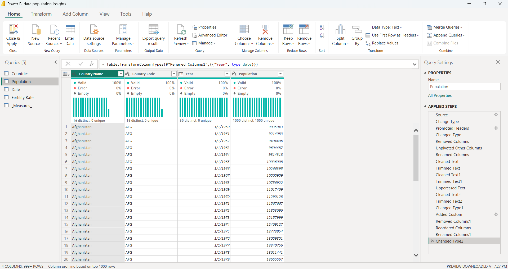
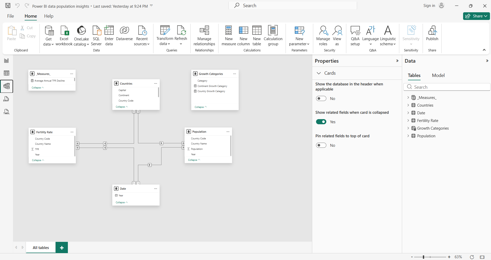
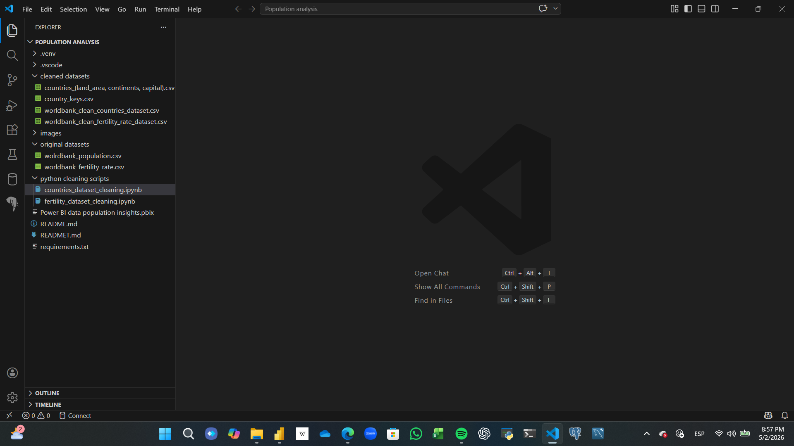
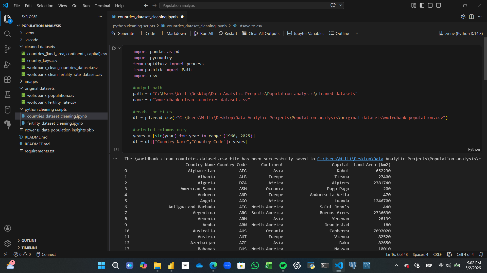
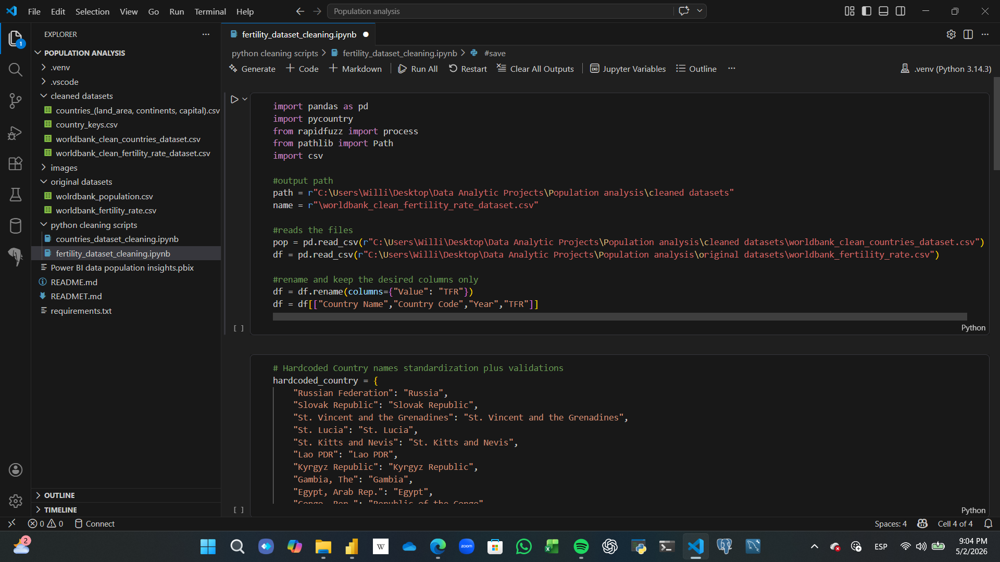
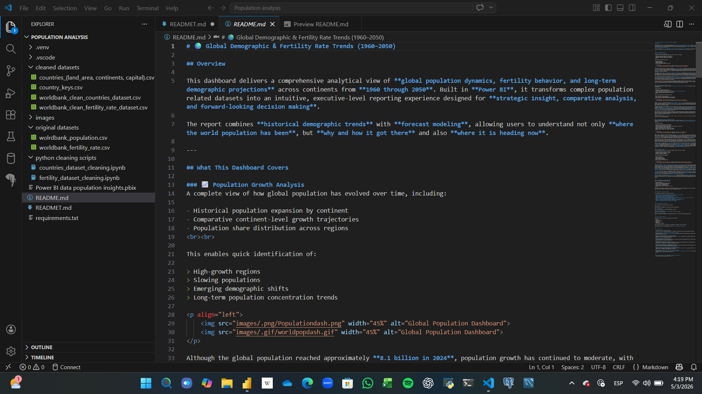
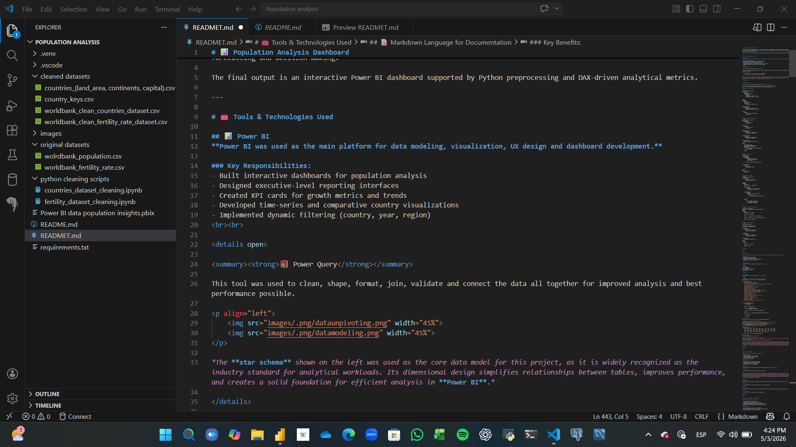

# 📊 Population Analysis Dashboard

This project analyzes global population trends, growth rates, and demographic evolution using a full end-to-end data analytics pipeline. It combines data engineering, statistical modeling, and interactive visualization to deliver insights for demographic forecasting and decision-making.

The final output is an interactive Power BI dashboard supported by Python preprocessing and DAX-driven analytical metrics.

---

# 🧰 Tools & Technologies Used

## 📊 Power BI
**Power BI was used as the main platform for data modeling, visualization, UX design and dashboard development.**

### Key Responsibilities:
- Built interactive dashboards for population analysis
- Designed executive-level reporting interfaces
- Created KPI cards for growth metrics and trends
- Developed time-series and comparative country visualizations
- Implemented dynamic filtering (country, year, region)
<br><br>

<details>

<summary><strong>🧮 Power Query</strong></summary>

This tool was used to clean, shape, format, join, validate and connect the data all together for improved analysis and best performance possible.

<p align="left">
    
    
</p>

*The **star schema** shown on the left was used as the core data model for this project, as it is widely recognized as the industry standard for analytical workloads. Its dimensional design simplifies relationships between tables, improves performance, and creates a solid foundation for efficient analysis in **Power BI**.*

</details>


<details>

<summary><strong>📐 DAX (Data Analysis Expressions)</strong></summary>  

DAX was used to build custom measures, KPIs, and analytical logic inside Power BI.  
Here are 6 of the most important measures used for KPIs and main analysis

### Countries Growth Rate

```DAX
Countries Growth Rate Avg = 
VAR YearTable =
    FILTER(
    VALUES('Date'[Year]),
    NOT ISBLANK(
        CALCULATE(
        SUM(Population[Population]),
        DATEADD('Date'[Year], -1, YEAR))
    )
)

RETURN
AVERAGEX(
    YearTable,
    VAR CurrentValue =
    CALCULATE(
        SUM(Population[Population])
    )

VAR PreviousValue =
    CALCULATE(
        SUM(Population[Population]),
        DATEADD('Date'[Year], -1, YEAR)
    )

RETURN
    DIVIDE(
        CurrentValue - PreviousValue,
        PreviousValue
    )
)
```

### Continents Average Growth Rate
```DAX
Continents avg growth rate = 
VAR StartDate =
    CALCULATE(
        MIN('Date'[Year]),
        ALL('Date')
    )

VAR EndDate =
    CALCULATE(
        MAX('Date'[Year]),
        ALL('Date')
    )

VAR StartPopulation =
    CALCULATE(
        SUM(Population[Population]),
        'Date'[Year] = StartDate
    )

VAR EndPopulation =
    CALCULATE(
        SUM(Population[Population]),
        'Date'[Year] = EndDate
    )

VAR YearsBetween =
    DATEDIFF(StartDate, EndDate, YEAR)

RETURN
IF(
    YearsBetween > 0 &&
    NOT ISBLANK(StartPopulation) &&
    NOT ISBLANK(EndPopulation),
    POWER(
        DIVIDE(EndPopulation, StartPopulation),
        1 / YearsBetween
    ) - 1,
    BLANK()
)
```

### Peak Growth Rate
```DAX
Peak Growth Rate = 
VAR BaseTable =
    ADDCOLUMNS(
        SUMMARIZE(
            ALLSELECTED(Population),
            Countries[Country Name],
            'Date'[Year]
        ),
        "Growth", [Countries Growth Rate Avg]
    )

VAR FilteredTable =
    FILTER(
        BaseTable,
        NOT ISBLANK([Growth])
    )

RETURN
MAXX(
    FilteredTable,
    [Growth]
)
```

### Average TFR decline
```DAX
Average Annual TFR Decline = 
VAR YearTable =
    FILTER(
        VALUES('Date'[Year]),
        YEAR('Date'[Year]) > 1960
    )

RETURN
AVERAGEX(
    YearTable,
    VAR CurrentYear = 'Date'[Year]

    VAR CurrentTFR =
        CALCULATE(
            AVERAGE('Fertility Rate'[TFR]),
            'Date'[Year] = CurrentYear
        )

    VAR PreviousTFR =
        CALCULATE(
            AVERAGE('Fertility Rate'[TFR]),
            FILTER(
                ALL('Date'[Year]),
                'Date'[Year] = EDATE(CurrentYear, -12)
            )
        )

    RETURN
        IF(
            NOT ISBLANK(CurrentTFR) &&
            NOT ISBLANK(PreviousTFR),
            PreviousTFR - CurrentTFR
        )
)
```

### Countries Growth Categorization
```DAX
Country Growth Category = 
VAR Growth = CALCULATE([Countries Growth Rate Avg])
RETURN
SWITCH(
    TRUE(),
    ISBLANK(Growth), BLANK(),

    Growth < 0, "Declining",

    Growth >= 0 && Growth < 0.002, "Stagnant",

    Growth >= 0.002 && Growth < 0.02, "Moderate Growth",

    Growth >= 0.02, "High Growth"
)
```

### People added by countries
```DAX
Most_population_added = 

VAR MINYEAR = MIN('Date'[Year])
VAR MAXYEAR = MAX('Date'[Year])

VAR MINPOP =
    CALCULATE(
        SUM(Population[Population]),
        'Date'[Year] = MINYEAR
    )

VAR MAXPOP =
    CALCULATE(
        SUM(Population[Population]),
        'Date'[Year] = MAXYEAR
    )

VAR YearCount =
    DISTINCTCOUNT('Date'[Year])

RETURN
SWITCH(
    TRUE(),

    YearCount = 1, MAXPOP,
    
    MAXPOP - MINPOP
)
```
</details>

<br><br>

---

## 🐍 Python

### Python was used for initial data cleaning, exploration, and preprocessing before visualization.

### Purpose:
- Data cleaning and preprocessing
- Exploratory data analysis (EDA)
- Validation of dataset structure and quality
- Preparation for Power BI ingestion
<br><br>


<details>
<summary><strong>🐍 Python libraries used</strong></summary>
<br><br>

```python
import pandas as pd
import pycountry
from rapidfuzz import process
from pathlib import Path
import csv
```
</details>


<details>
<summary><strong>⚙️ main engine script</strong></summary>
<br><br>

```Python
# Hardcoded Country names standarization plus validations
valid_countries = {c.name for c in pycountry.countries}

hardcoded_country = {
    "Russian Federation": "Russia",
    "Slovak Republic": "Slovak Republic",
    "St. Vincent and the Grenadines": "St. Vincent and the Grenadines",
    "St. Lucia": "St. Lucia",
    "St. Kitts and Nevis": "St. Kitts and Nevis",
    "Lao PDR": "Lao PDR",
    "Kyrgyz Republic": "Kyrgyz Republic",
    "Gambia, The": "Gambia",
    "Egypt, Arab Rep.": "Egypt",
    "Congo, Rep.": "Republic of the Congo",
    "Congo, Dem. Rep.": "Democratic Republic of the Congo",
    "Hong Kong SAR, China": "Hong Kong SAR, China",
    "Macao SAR, China": "Macao SAR, China",
    "Kosovo": "Kosovo",
    "Venezuela, RB": "Venezuela",
    "Iran, Islamic Rep.": "Iran",
    "Korea, Dem. People's Rep.": "North Korea",
    "Korea, Rep.": "South Korea",
    "Bolivia": "Bolivia",
    "West Bank and Gaza": "Palestine",
    "Viet Nam": "Vietnam",
    "Tanzania": "Tanzania",
    "United Arab Emirates": "United Arab Emirates"
}

def standardized_name(name):
    if pd.isna(name):
        return None

    name = str(name).strip()

    if name in hardcoded_country:
        return hardcoded_country[name]
    try:
        return pycountry.countries.lookup(name).name
    except:
        pass
    best, score, _ = process.extractOne(name, valid_countries)

    if score >= 85:
        return best

    return name

# apply function
df["Country Name"] = df["Country Name"].apply(standardized_name)

# duplicates and inconsistencies removal
priority_codes = ["ZAF","CAF","PAK","AFG","SYR","ATG","BIH","TCA", "TTO", "ARE"]
df["_priority"] = df["Country Code"].isin(priority_codes)
df = df.sort_values(["Country Name", "_priority"], ascending=[True, False])
df = df.drop_duplicates(subset=["Country Name"], keep="first")
df = df.drop(columns="_priority").reset_index(drop=True)

# Invalid countries drop by codes
invalid_codes = [
    "CSS", "EAR", "EAS", "EAP", "TEA", "EMU", "ECS", "ECA", "TEC", "EUU", "INX",
    "HPC", "HIC", "IBD", "IBT", "IDB", "IDX", "IDA", "LTE", "LCN", "LAC", "UMC",
    "LDC", "LMY", "LIC", "LMC", "MEA", "MNA", "TMN", "MIC", "NAC", "OED", "OSS",
    "PSS", "PST", "PRE", "SST", "TSA", "SSF", "SSA", "TSS", "TLA", "CHI", "FCS",
    "AFE", "SAS", "VAT", "TWN", "AFW", "ARB", "CEB", "WLD"]

df = df[~df["Country Code"].isin(invalid_codes)]

#drop n/a values
df = df.dropna(subset=["Country Name"])

#country area external dataset merge for completeness
area_df = pd.read_csv(r"C:\Users\Willi\Desktop\Data Analytic Projects\Population analysis\cleaned datasets\countries_(land_area, continents, capital).csv")
df = df.merge(area_df, on=["Country Name","Country Code"], how="left")
```
*This part of the code was the ⚙️ main engine and most important one that made the data-cleaning and filtering work possible for both dataset, the world population cleaning code was also in part reused for the Fertility Rate dataset cleaning. It is also well known that hardcoding values directly onto the code is not a good practice, however; an exeption was done as the pycountry library is outdated, it failed some times to correct the country names, even when the fuzzymatch library was also used for increased efficiency, as a result, no other option was left than harcoding some countries value for renaming and filtering purposes*

</details>

<br><br>

---

## 💻 Visual Studio Code

### Used as the main development environment for:  

- Python scripting
- Jupyter Notebook (.ipynb) execution
- Virtual environment (venv) management
- Code debugging and testing
- Data workflow organization

### Key Benefits:  

- Lightweight data development environment
- Integrated terminal for Python execution
- Seamless notebook + script workflow
- Better project structure management
<br><br>

<details>
<summary><strong>Microsoft Visual Studio Code, workspace structure</strong></summary>
<br><br>

<p align="left">
    
</p>

*The workspace was designed to centralize the entire data workflow, providing seamless access to raw CSV files, transformation scripts, and cleaned datasets ready for Power BI analysis. A dedicated Python environment was implemented to isolate dependencies, avoid package conflicts, and maintain a clean development space. Using this setup, .ipynb notebooks were created and edited efficiently, enabling smooth development of the data processing pipeline. This structure significantly improved workflow efficiency, making it easy to move between source data, code, and processed outputs in one unified workspace, with minimal friction during development and analysis.*

</details>

<details>
<summary><strong>Microsoft Visual Studio Code, world-bank population dataset cleaning python script</strong></summary>
<br><br>

<p align="left">
    
</p>

</details>


<details>
<summary><strong>Microsoft Visual Studio Code, world-bank Fertility Rate dataset cleaning python script</strong></summary>
<br><br>

<p align="left">
    
</p>

</details>
<br><br>

---

## 📝 Markdown Language for Documentation

### Used throughout the project for:

* Structuring project documentation
* Presenting technical explanations clearly
* Organizing code snippets and workflow sections
* Documenting methodology, findings, and project decisions
* Improving overall readability and project presentation

### Key Benefits:

* Clean and professional project documentation
* Easy formatting for headers, lists, tables, and code blocks
* Better organization of technical content
* Improved readability for viewers and collaborators
* Effective presentation of the project’s workflow and insights
<br><br>


<details>
<summary><strong>Project documentation development using the Markdown Language</strong></summary>  
<br><br>

<p align="left">
    
</p>

*This document showcases the development of the World Population Dashboard, highlighting its core insights, dashboard preview, and a concise analytical walkthrough for quick review. You may also notice a blend of pure Markdown and **HTML** syntax throughout the documentation an intentional choice made to achieve greater control over rendering and layout in sections where standard Markdown has limitations.*
<br><br>

<p align="left">
    
</p>

*This is where the project’s tools implementation walkthrough comes to life. A dedicated Markdown documentation was intentionally created for the tools used throughout this project to maintain a clean and structured setup. Instead of combining every technology into one large section, each tool is documented independently, allowing users to navigate directly to the information relevant to them.*

</details>