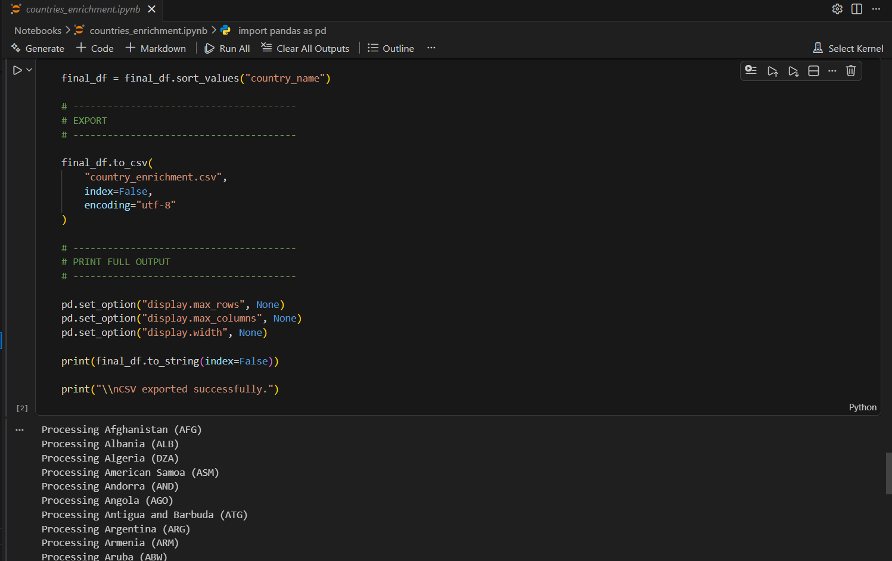

↩️ Regresar [Tendencias Globales de Demografía y Tasas de Fertilidad](README.es.md)  

<br><br>

# 🧰 Herramientas y Tecnologías Utilizadas
<br><br>

## 📊 Power BI
**Power BI se utilizó como la plataforma principal para el modelado de datos, visualización, diseño de UX y desarrollo de dashboards.**

### Responsabilidades clave:
- Construcción de dashboards interactivos para el análisis de población  
- Diseño de interfaces de reporte a nivel ejecutivo  
- Creación de tarjetas KPI para métricas y tendencias de crecimiento  
- Desarrollo de visualizaciones de series temporales y comparativas por país  
- Implementación de filtrado dinámico (país, año, región)  
<br><br>

<details>

<summary><strong>🧮 Power Query</strong></summary>

Esta herramienta se utilizó para dar forma, validar y conectar los datos entre sí para mejorar el análisis y obtener el mejor rendimiento posible.

<p align="left">
    
    
</p>

*El **star schema** mostrado en el screenshot se usó como el modelo de datos central para este proyecto, ya que es ampliamente reconocido como el estándar de la industria para cargas de trabajo analíticas. Su diseño dimensional simplifica las relaciones entre tablas, mejora el rendimiento y crea una base sólida para un análisis eficiente en **Power BI**.*

</details>


<details>

<summary><strong>📐 DAX (Data Analysis Expressions)</strong></summary>  

DAX se utilizó para construir medidas personalizadas, KPIs y lógica analítica dentro de Power BI.  
Aquí están 6 de las medidas más importantes usadas para KPIs y el análisis principal

### Tasa de crecimiento por paises

```DAX
Countries Growth Rate YoY = 

VAR YearContext =
    VALUES('world_population dim_year'[year_record])

VAR IsYearFiltered =
    ISFILTERED('world_population dim_year'[year_record])

VAR YearTable =
    FILTER(
        VALUES('world_population dim_year'[year_record]),
        NOT ISBLANK(
            CALCULATE(
                SUM('world_population fact_population'[population_count])
            )
        )
    )

VAR Result =
    AVERAGEX(
        YearTable,
        VAR CurrentYear = 'world_population dim_year'[year_record]

        VAR CurrentValue =
            CALCULATE(
                SUM('world_population fact_population'[population_count])
            )

        VAR PreviousValue =
            CALCULATE(
                SUM('world_population fact_population'[population_count]),
                'world_population dim_year'[year_record] = CurrentYear - 1
            )

        VAR Growth =
            DIVIDE(CurrentValue - PreviousValue, PreviousValue)

        RETURN
            Growth
    )

RETURN
IF(
    IsYearFiltered,
    Result,
    CALCULATE(Result, ALL('world_population dim_year'[year_record]))
)
```
### Tasa promedio de crecimiento por continentes
```DAX
Continents avg growth rate = 
VAR StartDate =
    CALCULATE(
        MIN('world_population dim_year'[year_record]),
        ALL('world_population dim_year')
    )

VAR EndDate =
    MAXX(
        FILTER(
            VALUES('world_population dim_year'[year_record]),
            NOT ISBLANK(
                CALCULATE(
                    SUM('world_population fact_population'[population_count])
                )
            )
        ),
        'world_population dim_year'[year_record]
    )

VAR StartPopulation =
    CALCULATE(
        SUM('world_population fact_population'[population_count]),
        TREATAS({StartDate}, 'world_population dim_year'[year_record])
    )

VAR EndPopulation =
    CALCULATE(
        SUM('world_population fact_population'[population_count]),
        TREATAS({EndDate}, 'world_population dim_year'[year_record])
    )

VAR YearsBetween =
    EndDate - StartDate

RETURN
IF(
    YearsBetween > 0 &&
    NOT ISBLANK(StartPopulation) &&
    NOT ISBLANK(EndPopulation) &&
    StartPopulation > 0,
    POWER(
        DIVIDE(EndPopulation, StartPopulation),
        1 / YearsBetween
    ) - 1,
    BLANK()
)
```

### Mas alta tasa de crecimiento
```DAX
Peak Growth Rate = 
VAR BaseTable =
    ADDCOLUMNS(
        SUMMARIZE(
            ALLSELECTED('world_population fact_population'),
            'world_population dim_countries'[country_name],
            'world_population dim_year'[year_record]
        ),
        "Growth", [Countries Growth Rate Avg]
    )

VAR FilteredTable =
    FILTER(
        BaseTable,
        NOT ISBLANK([Growth])
    )

RETURN
MAXX(
    FilteredTable,
    [Growth]
)
```

### Promedio en la caida de la Tasa de Fertilidad
```DAX
Average Annual TFR Decline = 

VAR YearTable =
    FILTER(
        VALUES('world_population dim_year'[year_record]),
        'world_population dim_year'[year_record] > 1960
    )

RETURN
AVERAGEX(
    YearTable,
    VAR CurrentYear = 'world_population dim_year'[year_record]

    VAR CurrentTFR =
        CALCULATE(
            AVERAGE('world_population fact_fertility_rate'[tfr]),
            'world_population dim_year'[year_record] = CurrentYear
        )

    VAR PreviousTFR =
        CALCULATE(
            AVERAGE('world_population fact_fertility_rate'[tfr]),
            'world_population dim_year'[year_record] = CurrentYear - 1
        )

    RETURN
        IF(
            NOT ISBLANK(CurrentTFR) &&
            NOT ISBLANK(PreviousTFR),
            PreviousTFR - CurrentTFR
        )
)
```

### Categorizacion del crecimiento de los paises
```DAX
Country Growth Category = 
VAR Growth = CALCULATE([Countries Growth Rate YoY])
RETURN
SWITCH(
    TRUE(),
    ISBLANK(Growth), BLANK(),

    Growth < 0, "Declining",

    Growth >= 0 && Growth < 0.002, "Stagnant",

    Growth >= 0.002 && Growth < 0.02, "Moderate Growth",

    Growth >= 0.02, "High Growth"
)
```

### Personas agregadas por pais
```DAX
Most_population_added = 

VAR MinYear =
    MIN('world_population dim_year'[year_record])

VAR MaxYearWithData =
    MAXX(
        FILTER(
            ALLSELECTED('world_population dim_year'[year_record]),
            NOT ISBLANK(
                CALCULATE(
                    SUM('world_population fact_population'[population_count])
                )
            )
        ),
        'world_population dim_year'[year_record]
    )

VAR MinPop =
    CALCULATE(
        SUM('world_population fact_population'[population_count]),
        'world_population dim_year'[year_record] = MinYear
    )

VAR MaxPop =
    CALCULATE(
        SUM('world_population fact_population'[population_count]),
        'world_population dim_year'[year_record] = MaxYearWithData
    )

VAR YearCount =
    DISTINCTCOUNT('world_population dim_year'[year_record])

RETURN
    IF(
        YearCount = 1,
        MaxPop,
        MaxPop - MinPop
    )
```
</details>

---

## 🐍 Python

### Python se utilizó como el motor ETL principal (dividido en cuatro secciones para mejor mantenibilidad).

### Propósito:
- Extracción de datos desde ambas APIs del World Bank  
- Limpieza y preprocesamiento de datos  
- Análisis exploratorio de datos (EDA)  
- Validación de la estructura y calidad de los datos  
- Preparación para la carga en Neon DB  
- Protección de credenciales  
<br><br>


<details>
<summary><strong>📚 Librerías de Python usadas</strong></summary>

```python
# REQUIRED LIBRARIES
import os
import sys
import base64
import pandas as pd
import numpy as np
import textwrap
import requests
import pycountry
import psycopg2
from psycopg2.extras import execute_batch
import json
from tabulate import tabulate
from dotenv import load_dotenv
from pathlib import Path
from cryptography.fernet import Fernet

# GOOGLE AUTH AND SERVICE LIBRARIES
from email.mime.text import MIMEText
from google.oauth2.credentials import Credentials
from google.auth.transport.requests import Request
from googleapiclient.discovery import build
from google_auth_oauthlib.flow import InstalledAppFlow
```
</details>

<details>
<summary><strong>🔌 Motor de Conexión</strong></summary>

```Python
# DATABASE CONNECTION
load_dotenv()

# DATABASE CREDENTIALS
DB_HOST = os.getenv("DB_HOST")
DB_NAME = os.getenv("DB_NAME")
DB_USER = os.getenv("DB_USER")
DB_PASSWORD = os.getenv("DB_PASSWORD")
DB_PORT = os.getenv("DB_PORT")

IS_CI = os.getenv("GITHUB_ACTIONS", "false").lower() == "true"

SCOPES = ["https://www.googleapis.com/auth/gmail.send"]

# TOKEN ENCRYPTION AND SECURITY SECTION
ENCRYPTION_KEY = os.getenv("TOKEN_ENCRYPTION_KEY")

if not ENCRYPTION_KEY:
    raise ValueError("Missing TOKEN_ENCRYPTION_KEY")

fernet = Fernet(ENCRYPTION_KEY.encode())


def save_token(creds):

    encrypted_token = fernet.encrypt(
        creds.to_json().encode()
    )

# LOCAL BASED ENV AND FILES USE, SECTION
    if not IS_CI:
        with open("token.enc", "wb") as f:
            f.write(encrypted_token)

def load_token():
    try:
        # WEB-BASED ENV USE (GITHUB_ACTIONS), SECTION
        if IS_CI:
            encrypted_token = os.getenv("TOKEN_ENC")

            if not encrypted_token:
                return None

            encrypted_token = encrypted_token.encode()

        else:
            if not os.path.exists("token.enc"):
                return None

            with open("token.enc", "rb") as f:
                encrypted_token = f.read()

        # AUTHENTICATION SECTION FOR BOTH SCENARIOS (LOCAL-BASED / WEB-BASED)
        decrypted_token = fernet.decrypt(
            encrypted_token
        )

        token_info = json.loads(
            decrypted_token.decode()
        )

        return Credentials.from_authorized_user_info(
            token_info,
            SCOPES
        )

    except Exception as e:
        if not IS_CI:
            print(f"Token load failed {e}")
        return None

TO_EMAIL = os.getenv("GMAIL_RECIPIENT")
if not TO_EMAIL:
    raise ValueError("Missing GMAIL_RECIPIENT")

creds = load_token()

# REFRESH IF POSSIBLE WITH 3 ATTEMPTS IN CASE OF FAILURE
if creds and creds.expired and creds.refresh_token:

    refresh_success = False

    for attempt in range(1, 4):

        try:
            creds.refresh(Request())
            save_token(creds)
            refresh_success = True
            break

        except Exception:
            continue

    if not refresh_success:
        creds = None

        if not IS_CI:
            print("Credential refresh attempts failed")

# IF NO CREDS, THEN RUN THE LOGIN POP-UP
if not creds:

    if IS_CI:
        raise RuntimeError("Running in CI environment: interactive OAuth login is not allowed")

    flow = InstalledAppFlow.from_client_secrets_file(
        "gmail_credentials.json",
        SCOPES
    )

    creds = flow.run_local_server(port=0)

# SAVE TOKEN FOR REUSE
if not creds:
    raise RuntimeError("No valid Gmail credentials available")
save_token(creds)

# GMAIL SERVICE INITIALIZATION
service = build("gmail", "v1", credentials=creds)

# TESTING THE CONNECTION
cur = None
connection = None

try:
    connection = psycopg2.connect(
        host=DB_HOST,
        database=DB_NAME,
        user=DB_USER,
        password=DB_PASSWORD,
        port=DB_PORT
    )

    cur = connection.cursor()

    cur.execute("SELECT version();")
    engine_version = cur.fetchone()[0]

    cur.execute("SELECT CURRENT_DATABASE();")
    database_name = cur.fetchone()[0]

    cur.execute("SET search_path TO world_population;")
    cur.execute("SELECT CURRENT_SCHEMA();")
    schema_name = cur.fetchone()[0]

    # EMAIL CONTENT
    subject = "SUCCESSFUL Database Connection - Gmail API"

    body = (
        f"""The database has been successfully connected.
    
Engine version:
{engine_version}

Database and schema name:
{database_name} | {schema_name}
""")

    msg = MIMEText(textwrap.dedent(body))
    msg["to"] = TO_EMAIL
    msg["subject"] = subject

    raw = base64.urlsafe_b64encode(msg.as_bytes()).decode()

    # SEND EMAIL
    service.users().messages().send(
        userId="me",
        body={"raw": raw}
    ).execute()

    if not IS_CI:
        print("Success database connection, email has been sent")

except Exception as e:

    subject = "FAILED Database Connection - Gmail API"

    body = str(e)

    msg = MIMEText(body)
    msg["to"] = TO_EMAIL
    msg["subject"] = subject

    raw = base64.urlsafe_b64encode(msg.as_bytes()).decode()

    service.users().messages().send(
        userId="me",
        body={"raw": raw}
    ).execute()

    if not IS_CI:
        print("Failed database connection, email has been sent")
```
*Esta sección del script maneja la conexión remota a la base de datos Neon PostgreSQL y la inicialización del servicio GMAIL API (AUTENTICACIÓN, REFRESH DE TOKENS, USO DE CREDENCIALES) para enviar notificaciones por correo y asegurar que cada proceso principal del pipeline ETL sea notificado en caso de fallos en la conexión a la base de datos o en la inicialización de GMAIL. La librería fernet se usó específicamente para encriptar los tokens y credenciales de GMAIL para aumentar la seguridad incluso si GitHub ya lo hace; esto añade una capa extra de protección.*
</details>

<details>
<summary><strong>⚙️ Motor de extracción y limpieza de datos</strong></summary>

```Python
# Hardcoded Country names standarization plus validations
# WORLD BANK APIs (POPULATION & FERTILITY RATE DATA)

indicator_map = {
    "population": "population_count",
    "fertility": "tfr"
}

apis = {
    "population":"https://api.worldbank.org/v2/country/all/indicator/SP.POP.TOTL?format=json&per_page=20000",
    "fertility":"https://api.worldbank.org/v2/country/all/indicator/SP.DYN.TFRT.IN?format=json&per_page=20000"
}

results = {}
cleaned_data = {}

api_debug = {}

try:
    for api_name, url in apis.items():
        current_api = api_name

        response = None
        
        for attempt in range(1, 4):
            try:
                response = requests.get(url, timeout=30)
                response.raise_for_status()
                break

            except requests.RequestException:
                if attempt == 3:
                    if not IS_CI:
                        print("API failed, 3 attempts already completed")
                    raise

        api_debug[api_name] = {
            "url": url,
            "status_code": response.status_code,
            "headers": dict(response.headers),
            "response_preview": response.text[:450],
            "response_length": len(response.text)
        }

        try:
            json_data = response.json()
        except ValueError:
            raise ValueError("WORLD BANK API ERROR: Invalid JSON response (likely HTML, empty response, or malformed API request)")

        if not (
            isinstance(json_data, list)
            and len(json_data) > 1
            and isinstance(json_data[1], list)
    ):
            raise ValueError(f"Invalid structure for {api_name}")

        results[api_name] = json_data[1]

except Exception as api_issues:

    subject = "API - ISSUES"

    body = f"""ETL stopped due to API failure.

ERROR MESSAGE:
{api_issues}

FAILED API:
{current_api if 'current_api' in locals() else 'unknown'}

API DEBUG:
{api_debug.get(current_api, {"error": "No debug info available"})}

Response Length:
{api_debug.get(current_api, {}).get("response_length", "unknown")}
"""


    msg = MIMEText(textwrap.dedent(body))
    msg["to"] = TO_EMAIL
    msg["subject"] = subject

    raw = base64.urlsafe_b64encode(msg.as_bytes()).decode()

    service.users().messages().send(
        userId="me",
        body={"raw": raw}
    ).execute()

    if not IS_CI:
        print("API ISSUES")
    sys.exit("ETL STOPPED")

# DATA CLEANING & TRANSFORMATION
def clean_world_bank_data(data, column_name):

    df = pd.json_normalize(data)

    df = df[["country.value", "countryiso3code", "date", "value"]]

    df = df.rename(columns={
    "country.value": "country_name",
    "countryiso3code": "country_code",
    "date": "year_record",
    "value": column_name
})

    inclusion = {"XKX", "CHI"}
    valid_country_codes = {country.alpha_3 for country in pycountry.countries}
    valid_country_codes = valid_country_codes.union(inclusion)

    df = df[df["country_code"].isin(valid_country_codes)]

    df["country_name"] = df["country_name"].astype("string").str.strip()
    df["country_code"] = df["country_code"].str.strip().str.upper()

    df["year_record"] = pd.to_numeric(df["year_record"], errors="coerce").astype("Int64")
    df[column_name] = pd.to_numeric(df[column_name], errors="coerce")

    return df

# CLEANING FOR BOTH APIs DATA REUSING THE FUNCTION "clean_world_bank_data".
for api_name, data in results.items():

    column_name = indicator_map[api_name]

    cleaned_data[api_name] = clean_world_bank_data(data, column_name)

population_df = cleaned_data["population"]
fertility_df = cleaned_data["fertility"]

country_names = {
"Venezuela, RB": "Venezuela",
"Iran, Islamic Rep.": "Iran",
"Korea, Rep.": "South Korea",
"Korea, Dem. People's Rep.": "North Korea",
"Egypt, Arab Rep.": "Egypt",
"Russian Federation": "Russia",
"Syrian Arab Republic": "Syria",
"Yemen, Rep.": "Yemen",
"Viet Nam": "Vietnam",
"Tanzania, United Republic of": "Tanzania",
"St. Martin (French part)": "French St. Martin",
"Sint Maarten (Dutch part)": "Dutch Sint Maarten",
"Puerto Rico (US)": "Puerto Rico",
"Micronesia, Fed. Sts.": "Micronesia",
"Moldova, Republic of": "Moldova",
"Bahamas, The": "Bahamas",
"Virgin Islands, British": "British Virgin Islands",
"Virgin Islands (U.S.)": "American Virgin Islands",
"West Bank and Gaza": "Palestine",
"Congo, Dem. Rep.": "Democratic Republic of the Congo",
"Congo, Rep.": "Republic of the Congo",
"Somalia, Fed. Rep.": "Somalia",
"Slovak Republic": "Republic of Slovakia",
}

def rename_countries(country):
    if pd.isna(country):
        return country
    country = str(country).strip()
    return country_names.get(country, country)


population_df["country_name"] = population_df["country_name"].apply(rename_countries)
fertility_df["country_name"] = fertility_df["country_name"].apply(rename_countries)

#DATA ENRICHEMENT

def get_project_root():

    # IF CI ENVS
    env_root = os.getenv("PROJECT_ROOT")
    if env_root:
        return Path(env_root)

    # IF SCRIPT FILE
    if "__file__" in globals():
        return Path(__file__).resolve().parent

    # IF NOTEBOOK FALLBACK
    return Path.cwd()

BASE_DIR = get_project_root()

file_path = BASE_DIR / "cleaned_datasets" / "country_enrichment.csv"

if not file_path.exists():
    msg = f"Missing file at: {file_path}"

    if not IS_CI:
        print(msg)
        
    raise FileNotFoundError(msg)

country_enrichment = pd.read_csv(file_path)
enrichment_details = country_enrichment[["country_code", "capital", "land_area_km2", "continent"]]
enrichment_details["country_code"] = enrichment_details["country_code"].str.strip().str.upper()

try:
    population_df = population_df.merge(enrichment_details, on=["country_code"], how="left")
    population_df = population_df[["country_name", "country_code", "year_record", "population_count", "land_area_km2", "capital", "continent"]]
    fertility_df = fertility_df[["country_name", "country_code", "year_record", "tfr"]]
except Exception as mergeissue:
    if not IS_CI:
        print(mergeissue) 
    subject = "Countries_Enrichment - Gmail API"

    body = f"""The enrichmenet has failed due to.
    
Error:
{mergeissue}
"""

    msg = MIMEText(textwrap.dedent(body))
    msg["to"] = TO_EMAIL
    msg["subject"] = subject

    raw = base64.urlsafe_b64encode(msg.as_bytes()).decode()

    # SEND EMAIL
    service.users().messages().send(
        userId="me",
        body={"raw": raw}
    ).execute()


#FINAL DATA CLEANING
population_df["capital"] = population_df["capital"].astype("string").str.strip().str.title()
population_df["continent"] = population_df["continent"].astype("string").str.strip().str.title()
population_df["land_area_km2"] = pd.to_numeric(population_df["land_area_km2"], errors="coerce")

population_df["population_count"] = pd.to_numeric(population_df["population_count"], errors="coerce").astype("Int64")
fertility_df["tfr"] = pd.to_numeric(fertility_df["tfr"], errors="coerce")

#QUICK DATA VALIDATION
if not IS_CI:
    print("POPULATION DATA")
    print(population_df.head(10))

    print("\nFERTILITY DATA:")
    print(fertility_df.head(5))
```
*Esta parte del código fue el motor ⚙️ principal y la más importante que permitió que la limpieza y el filtrado de datos funcionaran para ambos datasets de la API; esta parte del script maneja errores y notifica sobre ellos también. Es bien sabido que hardcodear valores directamente en el código no es una buena práctica; sin embargo, se hizo una excepción ya que la librería pycountry está desactualizada y falló algunas veces al corregir los nombres de países. Como resultado, no quedó otra opción que hardcodear algunos valores de países para propósitos de renombrado y filtrado. Se realizó una fusión con un dataset local, el cual también fue obtenido mediante un script de Python aparte del principal, ya que las APIs del World Bank no entregan los detalles deseados como capitales, continentes y km2 de territorio en la misma petición de API.*
</details>

<details>
<summary><strong>🫕 Preparación de valores para las tablas de la base de datos</strong></summary>

```Python
#PREPARING DATA FOR DIM_YEAR VALUES INSERTION

# PANDAS NAN VALUES HANDLING
def to_pg_value(x):
    if pd.isna(x):
        return None
    if isinstance(x, np.generic):
        return x.item()
    return x


def df_to_pg_records(df):
    return [
        tuple(to_pg_value(x) for x in row)
        for row in df.itertuples(index=False, name=None)
    ]

dim_year_table = (population_df[["year_record"]].drop_duplicates().dropna(subset=["year_record"]).assign(year_record=lambda df:pd.to_numeric(df["year_record"], errors="raise")))
dim_year_table_values = df_to_pg_records(dim_year_table)

dim_year_insert_query ="""
INSERT INTO dim_year (year_record)
VALUES (%s)
ON CONFLICT (year_record) DO NOTHING;
"""

dim_countries_table = population_df[["country_name", "country_code", "capital", "continent", "land_area_km2"]].drop_duplicates().dropna(subset=["country_code"])
dim_countries_table_values = df_to_pg_records(dim_countries_table)

dim_countries_insert_query = """
INSERT INTO dim_countries (country_name, country_code, capital, continent, land_area_km2)
VALUES (%s, %s, %s, %s, %s)
ON CONFLICT (country_code)
DO UPDATE SET
    country_name = EXCLUDED.country_name,
    capital = EXCLUDED.capital,
    continent = EXCLUDED.continent,
    land_area_km2 = EXCLUDED.land_area_km2
WHERE
    dim_countries.country_name IS DISTINCT FROM EXCLUDED.country_name
    OR dim_countries.capital IS DISTINCT FROM EXCLUDED.capital
    OR dim_countries.continent IS DISTINCT FROM EXCLUDED.continent
    OR dim_countries.land_area_km2 IS DISTINCT FROM EXCLUDED.land_area_km2;
    """

fact_population_table = population_df[["country_code", "year_record", "population_count"]].drop_duplicates(subset=["country_code", "year_record"]).dropna(subset=["year_record", "country_code"])
fact_population_table_values = df_to_pg_records(fact_population_table)

fact_population_insert_query ="""
INSERT INTO fact_population
(country_code, year_record, population_count)
VALUES (%s, %s, %s)

ON CONFLICT (country_code, year_record)

DO UPDATE
SET population_count = EXCLUDED.population_count

WHERE fact_population.population_count
IS DISTINCT FROM EXCLUDED.population_count;
"""

fact_fertility_rate_table = fertility_df[["country_code", "year_record", "tfr"]].drop_duplicates(subset=["country_code", "year_record"]).dropna(subset=["year_record", "country_code"])
fact_fertility_rate_table_values = df_to_pg_records(fact_fertility_rate_table)

fact_fertility_rate_insert_query ="""
INSERT INTO fact_fertility_rate
(country_code, year_record, tfr)
VALUES (%s, %s, %s)

ON CONFLICT (country_code, year_record)

DO UPDATE
SET tfr = EXCLUDED.tfr

WHERE fact_fertility_rate.tfr
IS DISTINCT FROM EXCLUDED.tfr;"""
```
*Esta sección se encarga de la preparación de datos para las tablas de Neon PostgreSQL; los valores están bien limpiados y formateados para evitar problemas de base de datos y tipos de datos, manteniendo la integridad de los datos. La cláusula ```ON CONFLICT () DO UPDATE``` fue diseñada para evitar sobrescribir datos nuevos cada vez que el script se ejecuta; solo actualiza los datos faltantes o sobrescribe los existentes cuando es necesario, lo cual es una buena práctica para pipelines ETL, ya que a veces la organización World Bank actualiza o corrige sus valores; esto asegura que solo los valores diferentes a los existentes sean insertados para mantener eficiencia en memoria y velocidad.*
</details>

<details>
<summary><strong>💾 Motor de inserción y almacenamiento en la base de datos</strong></summary>

```Python
# EMAIL HEADERS
headers = ["Country", "Code", "Total Years Recorded"]

try:
   # LOAD DIM_YEAR
    execute_batch(cur,dim_year_insert_query, dim_year_table_values, page_size=1000)

    # LOAD DIM_COUNTRIES
    execute_batch(cur, dim_countries_insert_query, dim_countries_table_values, page_size=1000)
    
    #LOAD FACT_POPULATION 
    execute_batch(cur, fact_population_insert_query, fact_population_table_values, page_size=1000)

    #LOAD FACT_FERILTITY_RATE
    execute_batch(cur, fact_fertility_rate_insert_query, fact_fertility_rate_table_values, page_size=1000)

    #COMMIT THE INSERTION
    connection.commit()

    # DIM_YEAR QUERY
    cur.execute("SELECT COUNT(*) AS years_count FROM dim_year")
    dim_year_query = cur.fetchone()[0]
    cur.execute("SELECT MIN(year_record) FROM dim_year")
    min_dim_year = cur.fetchone()[0]
    cur.execute("SELECT MAX(year_record) FROM dim_year")
    max_dim_year = cur.fetchone()[0]

    # DIM_COUNTRIES QUERY
    cur.execute("SELECT COUNT(country_code) AS total_countries FROM dim_countries")
    dim_countries_query = cur.fetchone()[0]

    # FACT_POPULATION QUERY
    cur.execute("""SELECT
                dc.country_name AS Countries,
                dc.country_code AS Code,
                COUNT(fp.year_record) AS total_years_recorded
                FROM dim_countries AS dc
                LEFT JOIN fact_population AS fp
                ON dc.country_code = fp.country_code 
                GROUP BY dc.country_name, dc.country_code
                ORDER BY total_years_recorded DESC
                """)

    # EMAIL PRETTY PRINT :)
    fact_population_query = cur.fetchall()
    population_summary = tabulate(fact_population_query, headers=headers, tablefmt="grid")

    # FACT_FERTILITY_RATE QUERY
    cur.execute("""SELECT
                dc.country_name AS Countries,
                dc.country_code AS Code,
                COUNT(ff.year_record) AS total_years_recorded
                FROM dim_countries AS dc
                LEFT JOIN fact_fertility_rate AS ff
                ON dc.country_code = ff.country_code 
                GROUP BY dc.country_name, dc.country_code
                ORDER BY total_years_recorded DESC
                """)

    # EMAIL PRETTY PRINT :)
    fact_fertility_query = cur.fetchall()
    fertility_summary = tabulate(fact_fertility_query, headers=headers, tablefmt="grid")

    # EMAIL NOTIFICATION OF THE SUCCESSFUL INSERTION WITH THE CONFIRMATION OF THE NUMBER OF VALUES IN THE TABLE
    subject = "SUCCESSFUL DATABASE INSERTION"
    body = f"""
    
The YEAR table has been successfully updated.
Total years count: {dim_year_query}
MIN year: {min_dim_year}
MAX year: {max_dim_year}

The COUNTRIES table has been successfully updated.
Total countries count: {dim_countries_query}

The POPULATION table has been successfully updated.
{population_summary}

The FERTILITY table has been successfully updated.
{fertility_summary}
"""

    msg = MIMEText(textwrap.dedent(body))
    msg["to"] = TO_EMAIL
    msg["subject"] = subject

    raw = base64.urlsafe_b64encode(msg.as_bytes()).decode()
    service.users().messages().send(
    userId="me",
    body={"raw": raw}
    ).execute()

    if not IS_CI:
        print("SUCCESSFUL DATABASE INSERTION. EMAIL HAS BEEN SENT")

except Exception as e:
    # ROLLBACK TRANSACTION AND SEND FAILURE NOTIFICATION
    connection.rollback()

    subject = "FAILED VALUES INSERTION"
    body = (
    f"""Failed insertions due to error message:

{e}"""
    )

    msg = MIMEText(textwrap.dedent(body))
    msg["to"] = TO_EMAIL
    msg["subject"] = subject

    raw = base64.urlsafe_b64encode(msg.as_bytes()).decode()
    service.users().messages().send(
    userId="me",
    body={"raw": raw}
    ).execute()

    if not IS_CI:
        print(f"""Error occurred: {e}. email sent""")
    raise e
    
    # AFTER THE SCRIPT RUNS SUCCESSFULLY, CLOSE THE DB CONNECTION
finally:

    if cur is not None:
        cur.close()

    if connection is not None:
        connection.close()
```
*Esta sección maneja la etapa final de todo el pipeline ETL; inserta los valores en sus tablas correspondientes dentro de la base de datos Neon, almacenándolos de forma segura y listos para alimentar los dashboards de Power BI. La clave aquí es que se mantuvo la atomicidad del proceso: TODO se inserta si todo va bien, o NADA se inserta si el script o los datos fallan, para asegurar que no haya cargas parciales; finalmente, la conexión remota a la base de datos se cerró como buena práctica en la etapa final del script.*
</details>


---

## 💻 Visual Studio Code

### Usado como el entorno principal de desarrollo para:  

- Scripting en Python  
- Ejecución de Jupyter Notebook (.ipynb)  
- Gestión de entornos virtuales (venv)  
- Depuración y pruebas de código  
- Organización del flujo de trabajo de datos  

### Beneficios clave:  

- Entorno de desarrollo ligero para datos  
- Terminal integrado para ejecución de Python  
- Flujo de trabajo fluido entre notebooks y scripts  
- Mejor gestión de la estructura del proyecto  
<br><br>

<details>
<summary><strong>Microsoft Visual Studio Code, estructura del workspace</strong></summary>
<br><br>

<p align="left">
    
</p>

*El espacio de trabajo fue diseñado para centralizar todo el flujo de trabajo de análisis de datos, proporcionando un entorno unificado para la ingesta, transformación, validación, almacenamiento y generación de reportes. Se implementó un entorno dedicado de Python para aislar dependencias, evitar conflictos entre paquetes y mantener un espacio de desarrollo limpio y organizado. Utilizando esta configuración, se crearon y editaron cuadernos `.ipynb` de manera eficiente, permitiendo el desarrollo fluido del pipeline de procesamiento de datos. Esta estructura mejoró significativamente la eficiencia del flujo de trabajo, facilitando la transición entre los datos de origen, el código y los resultados procesados dentro de un único espacio de trabajo unificado, minimizando la fricción durante las etapas de desarrollo y análisis.*
</details>

<details>
<summary><strong>Microsoft Visual Studio Code, script de limpieza de los datos de la población del World Bank</strong></summary>
<br><br>

<p align="left">
    
</p>

</details>


<details>
<summary><strong>Microsoft Visual Studio Code, script de limpieza de los datos TFR del World Bank</strong></summary>
<br><br>

<p align="left">
    
</p>

</details>
<br>

--- 

## 📝 Lenguaje Markdown para la Documentación

### Usado a lo largo del proyecto para:

* Estructurar la documentación del proyecto
* Presentar explicaciones técnicas con claridad
* Organizar fragmentos de código y secciones de flujo de trabajo
* Documentar metodología, hallazgos y decisiones del proyecto
* Mejorar la legibilidad general y la presentación del proyecto

### Beneficios clave:

* Documentación del proyecto limpia y profesional
* Formateo sencillo para encabezados, listas, tablas y bloques de código
* Mejor organización del contenido técnico
* Mayor legibilidad para espectadores y colaboradores
* Presentación efectiva del flujo de trabajo y los insights del proyecto  
<br><br>

<details>
<summary><strong>Desarrollo de la documentación del proyecto usando el Lenguaje Markdown</strong></summary>  
<br><br>

<p align="left">
    
</p>

*Este documento muestra el desarrollo del World Population Dashboard, destacando sus insights principales, vista previa del dashboard y un recorrido analítico conciso para una revisión rápida. También puede notar una mezcla de Markdown puro y sintaxis **HTML** a lo largo de la documentación; una elección intencional hecha para lograr mayor control sobre el renderizado y el diseño en secciones donde el Markdown estándar tiene limitaciones.*  
<br><br>

<p align="left">
    
</p>

*Aquí es donde cobra vida el recorrido de implementación de las herramientas del proyecto. Se creó intencionalmente una documentación en Markdown dedicada para las herramientas usadas a lo largo de este proyecto con el fin de mantener una configuración limpia y estructurada. En lugar de combinar cada tecnología en una sección grande, cada herramienta se documenta de forma independiente, permitiendo a los usuarios navegar directamente a la información relevante para ellos.*  
</details>
<br>

---

## 🌐 [Neon Serverless PostgreSQL](https://neon.com/)

### Implementado como componente central para:

* Diseñar e implementar la arquitectura de la base de datos relacional
* Almacenar y gestionar datos transformados en una base de datos PostgreSQL centralizada y alojada en la nube
* Soportar la fase de carga del pipeline ETL mediante inserciones por lotes y operaciones transaccionales
* Habilitar acceso remoto escalable a la base de datos desde entornos locales y automatizados
* Servir como el data warehouse analítico del proyecto para reportes posteriores
* Optimizar el rendimiento de consultas mediante indexación y buenas prácticas de diseño relacional
* Persistir datasets históricos de población y fertilidad para análisis longitudinal
* Alimentar el dashboard final y las visualizaciones analíticas con datos estructurados y listos para consultar
* Permitir extensibilidad futura para indicadores demográficos y datasets adicionales
* Gestionar tablas de hechos y dimensiones normalizadas siguiendo una estructura inspirada en star schema

### Beneficios clave:  

* Autoscaling: los recursos de cómputo escalan automáticamente según la carga.
* Scale-to-zero: las bases de datos pueden suspenderse cuando están inactivas y reiniciarse bajo demanda.
* Ayuda a reducir costos de infraestructura para aplicaciones de bajo tráfico, proyectos secundarios o entornos de desarrollo.
* Precio basado en uso: se paga principalmente por el uso real de cómputo y almacenamiento en lugar de capacidad fija de servidor.
* Evita el sobredimensionamiento común en el alojamiento PostgreSQL tradicional.
* Separación de cómputo y almacenamiento: Neon desacopla almacenamiento de cómputo, permitiendo escalado elástico y operaciones de infraestructura más rápidas.
* Hace que el branching y las restauraciones sean mucho más rápidas que en despliegues PostgreSQL estándar.
* Branching de bases de datos: se pueden crear ramas instantáneas de la base de datos similares a ramas de Git.
* Pooling de conexiones incorporado: incluye pooling estilo PgBouncer automáticamente.
* Restaurar bases de datos a estados previos rápidamente sin backups complejos ni recuperación punto en el tiempo.
* Totalmente compatible con PostgreSQL  
<br><br>

<details>
<summary><strong>🎛️ UI principal de Neon</strong></summary>  
<br><br>

<p align="left">
    
</p>

*Desde esta UI se puede gestionar toda la base de datos fácilmente; las conexiones, usuarios, recursos y más...*  
</details>

<details>
<summary><strong>🖇️ Branches en Neon</strong></summary>  
<br><br>


<p align="left">
    
</p>

*Como Neon soporta la funcionalidad de branching de bases de datos similar a Git, se creó una rama de desarrollo separada para fines de prueba durante el desarrollo del motor del pipeline. Este entorno aislado se utilizó para validar la lógica ETL, probar transformaciones, verificar la consistencia de los datos y realizar controles de aseguramiento de calidad antes del despliegue a la base de datos de producción y al repositorio en GitHub.*

*El flujo de trabajo de branching permitió prototipado seguro y desarrollo iterativo sin afectar el entorno de producción, asegurando la fiabilidad, integridad y estabilidad del pipeline final antes del lanzamiento.*  
</details>


<details>
<summary><strong>🔷 Schema en Neon</strong></summary>  
<br><br>


<p align="left">
    
</p>

*Desde aquí tenemos acceso a todas las configuraciones a nivel de esquema, una UI simple para uso fácil donde las tablas pueden ser alteradas, el esquema cambiado, restricciones añadidas/eliminadas o modificadas y los valores de las tablas editados.*  
</details>

<details>
<summary><strong>🔃 Queries en Neon</strong></summary>  
<br><br>


<p align="left">
    
</p>

*En esta sección, todas las tablas disponibles pueden ser consultadas para ver sus datos.*  
</details>

---

## 🐘 PostgreSQL

### Aplicado en todo el proyecto para:

* Crear esquemas, tablas, restricciones, claves primarias y relaciones de claves foráneas
* Soportar validación e integridad de datos mediante restricciones y enforcement de tipos en PostgreSQL
* Gestión de usuarios y cuentas
* Validaciones rápidas de datos y pruebas exploratorias de consultas
* Alteraciones rápidas de esquema y refinamientos iterativos de la base de datos durante el desarrollo
* Creación de roles y usuarios para control de acceso y gestión de permisos
* Visualización completa del esquema
* Soportar operaciones de bases de datos escalables alojadas en la nube mediante integración con Neon
* Pruebas de conexión remota a Neon

### Beneficios clave:

* Fuertes capacidades de base de datos relacional para cargas analíticas estructuradas
* Alta integridad y fiabilidad de datos mediante transacciones ACID
* Soporte robusto para restricciones, relaciones y enforcement de tipos
* Excelente rendimiento para consultas SQL complejas, joins y agregaciones
* Arquitectura escalable adecuada para grandes datasets demográficos históricos
* Capacidades avanzadas de indexación y optimización de consultas
* Integración fluida con pipelines ETL basados en Python y herramientas analíticas
* Gran compatibilidad con plataformas de business intelligence como Power BI
* Gestión flexible de esquemas para desarrollo iterativo y prototipado rápido
* Soporte para control de acceso basado en roles y administración segura de la base de datos
* Manejo eficiente de modelos de datos relacionales normalizados
* Soporte confiable de despliegue en la nube a través de Neon
* Capacidades de branching en Neon que habilitaron entornos de prueba y desarrollo aislados
* Ecosistema open-source con amplia comunidad y documentación
* Bien adaptado para data warehousing, analítica y proyectos orientados a ETL
* Fuerte consistencia transaccional para pipelines de datos de grado producción  
<br><br>

<details>
<summary><strong>🔷 Creación de esquema en PostgreSQL</strong></summary>  
<br><br>

<p align="left">
    
</p>

*Aquí, usando PostgreSQL PgAdmin, se crearon, gestionaron y alteraron el esquema, las tablas y los usuarios para tener un diseño de modelado apropiado que sostenga los datos para su uso.*  
</details>


<details>
<summary><strong>🔷 Visualización del esquema en PostgreSQL</strong></summary>  
<br><br>


<p align="left">
    
</p>

*Aquí podemos obtener una estructura de esquema más clara y comprensible con esta característica incorporada de PostgreSQL que permite a los usuarios visualizar el esquema.*  
</details>

---

## ☁️ [Google Cloud](https://cloud.google.com/)

### Desempeñó un papel central en:

* Alojar y gestionar las integraciones de API del proyecto
* Habilitar y configurar la API de Gmail para notificaciones automatizadas por correo
* Gestionar credenciales de autenticación OAuth 2.0
* Monitorear tráfico de API, latencia y tasas de error
* Rastrear consumo de cuota y métricas de uso de las APIs
* Asegurar el acceso mediante consentimiento OAuth y gestión de credenciales
* Proveer administración centralizada para servicios en la nube usados por la aplicación

### Beneficios clave:

* Autenticación segura OAuth 2.0 para la integración con Gmail
* Gestión centralizada de APIs y credenciales del proyecto
* Monitoreo incorporado para rendimiento y fiabilidad de APIs
* Analíticas de uso para ayudar a solucionar y optimizar el consumo de APIs
* Gestión de cuotas para prevenir interrupciones del servicio
* Infraestructura en la nube escalable sin requerir mantenimiento de servidores
* Integración simplificada con el ecosistema y herramientas de desarrollo de Google  
<br><br>

<details>
<summary><strong>Métricas de la API Gmail en Google Cloud Platform</strong></summary>  
<br><br>

<p align="left">
    
</p>

<p align="left">
    
</p>

<p align="left">
    
</p>

<p align="left">
    
</p>

<p align="left">
    
    
</p>

*En esta sección se revisaron y monitorearon todas las métricas disponibles de la API Gmail y la información de estado del servicio para verificar la disponibilidad de la API, comportamiento de respuesta, latencia, patrones de tráfico, consumo de cuota y tasas de error. Además, se realizaron múltiples pruebas de validación para confirmar la autenticación OAuth 2.0 exitosa, conectividad de la API, funcionalidad de entrega de correos, uso de credenciales, operaciones de refresh de tokens y la fiabilidad general de la integración durante las fases de desarrollo y pruebas de este proyecto.*  
</details>

---

## 💾 Git

### Adoptado para gestionar y soportar:

* Control de versiones a lo largo de todo el ciclo de vida del proyecto
* Seguimiento del código fuente y gestión del historial de cambios
* Desarrollo de funcionalidades mediante commits incrementales
* Experimentación segura y capacidades de rollback
* Flujos de trabajo listos para colaboración y organización del repositorio
* Desarrollo, pruebas y mantenimiento del pipeline ETL
* Versionado y actualizaciones de la documentación
* Respaldo del proyecto y preservación del código fuente
* Preparación de releases y seguimiento de despliegues
* Auditoría de cambios y trazabilidad del desarrollo

### Beneficios clave:

* Historial completo de cambios de código y del proyecto
* Fácil rollback a versiones estables previas cuando sea necesario
* Mejor organización del código y flujo de trabajo de desarrollo
* Mayor fiabilidad del proyecto mediante seguimiento de versiones
* Mejor depuración al identificar cuándo se introdujeron cambios
* Reducción del riesgo de pérdida accidental de datos o código
* Soporte para branching y desarrollo de funcionalidades aisladas
* Facilita la colaboración y los procesos de revisión de código
* Prácticas de control de versiones estándar en la industria
* Mejor mantenibilidad y gestión a largo plazo del proyecto
* Mayor transparencia y trazabilidad de las actividades de desarrollo
* Integración fluida con plataformas de hosting de repositorios como GitHub  
<br><br>

<details>
<summary><strong>📥 Inicialización y estado de GIT</strong></summary>  
<br><br>

<p align="left">
    
</p>

*Git se utilizó para inicializar y gestionar el sistema de control de versiones del proyecto. Durante el desarrollo, el comando `git status` se empleó para inspeccionar el estado actual del repositorio, identificar archivos modificados, detectar archivos nuevos no rastreados y verificar cambios en staging antes de los commits.*
</details>

<details>
<summary><strong>🗃️ Registro de GIT</strong></summary>  
<br><br>

<p align="left">
    
</p>

*El comando `git log` se utilizó para revisar el historial de commits, validar commits exitosos, rastrear la evolución del proyecto y mantener una traza completa de auditoría de todos los cambios en el código fuente y la documentación.*  
</details>

<details>
<summary><strong>📨 Git Add y Commit</strong></summary>  
<br><br>

<p align="left">
    
</p>

*El comando `git add` se usó para stagear archivos relevantes, mientras que `git commit -m "<message>"` se empleó para crear snapshots documentados del progreso del proyecto.*  
</details>

---

## 🗒️ Jupyter Lab

### Usado para potenciar los siguientes componentes del proyecto:

* Aislamiento y prueba de nuevas líneas de código
* Desarrollo interactivo y pruebas de procesos ETL
* Exploración y validación de datos paso a paso
* Flujos de trabajo de limpieza, transformación y preprocesamiento de datos
* Ejecución de celdas de código Python para depuración incremental
* Verificación de respuestas de APIs y chequeos de calidad de datos
* Análisis de datasets intermedios antes de la carga en la base de datos
* Prototipado rápido de lógica de extracción y transformación de datos
* Documentación de procesos de desarrollo mediante celdas de notebook
* Validación de consultas PostgreSQL e interacciones con la base de datos

### Beneficios clave:

* Ejecución interactiva de código sin correr todo el script
* Depuración y resolución de problemas más rápida durante el desarrollo
* Mejor visibilidad de variables y datasets intermedios
* Pruebas eficientes de transformaciones de datos y lógica de negocio
* Procesos simplificados de exploración de datos y aseguramiento de calidad
* Capacidad de combinar código, salidas y documentación en un solo espacio de trabajo
* Desarrollo ETL optimizado mediante ejecución por celdas
* Mayor productividad al trabajar con grandes datasets y APIs
* Integración fluida con Visual Studio Code mediante la extensión Jupyter  
<br><br>

<details>
<summary><strong>👀 Visualización de datos en celdas de Jupyter Lab</strong></summary>  
<br><br>

<p align="left">
    
</p>

<p align="left">
    
</p>

<p align="left">
    
</p>

<p align="left">
    
</p>

<p align="left">
    
</p>

*Como se ilustra en las capturas anteriores, las celdas de Jupyter se usaron durante todo el proceso de desarrollo para visualizar datos y ejecutar código de forma incremental. La interfaz del notebook proporciona controles que permiten ejecutar celdas individualmente o todas en secuencia, lo que facilitó pruebas aisladas de segmentos de código específicos antes de integrarlos en el script de producción. Este enfoque ayudó a mejorar la estabilidad al validar funcionalidades en unidades más pequeñas y controladas.*

*Adicionalmente, se usaron múltiples celdas para organizar el script en secciones lógicas, haciendo la depuración, el mantenimiento y las futuras actualizaciones más eficientes. El flujo de trabajo basado en celdas también facilitó la inspección de variables, respuestas de APIs, transformaciones de datos y operaciones de base de datos durante el desarrollo. Además, el entorno Jupyter se configuró para usar el entorno virtual Python del proyecto (venv), asegurando que todas las dependencias, librerías y versiones de paquetes requeridas permanecieran aisladas de la instalación Python del sistema y consistentes con el entorno de producción. Esto ayudó a mantener la reproducibilidad y evitar conflictos de dependencias a lo largo del ciclo de vida del proyecto.*  
</details>

---

## 🤖 Chats de A.I

### Configurados y utilizados para:

* Traducir la documentación del proyecto del inglés al español preservando la terminología técnica y el formateo
* Realizar evaluaciones de factibilidad y disponibilidad de datos antes de la implementación
* Investigar APIs, métodos de autenticación, endpoints, cuotas y requisitos de integración
* Explorar documentación técnica, librerías, frameworks y herramientas de desarrollo usadas en el proyecto
* Asistir en troubleshooting, depuración y validación de enfoques de implementación
* Revisar buenas prácticas relacionadas con desarrollo ETL, diseño de bases de datos e integraciones de API
* Apoyar la comprensión de PostgreSQL, Git, GitHub Actions y documentación de servicios en la nube

### Beneficios clave:

* Traducción de documentación más rápida con menor esfuerzo manual
* Procesos de investigación y recopilación de información acelerados
* Mayor productividad durante investigaciones técnicas
* Acceso más rápido a ejemplos de implementación y buenas prácticas
* Mejor comprensión de tecnologías y servicios desconocidos
* Reducción del tiempo de desarrollo al evaluar APIs y herramientas externas
* Interpretación simplificada de documentación técnica y especificaciones
* Resolución de problemas más rápida mediante explicaciones guiadas y recomendaciones
* Mayor eficiencia al validar arquitectura y decisiones de diseño del proyecto
* Asistencia centralizada para desarrollo, documentación e investigación  
<br><br>

<details>
<summary><strong>🔍 Búsqueda de API</strong></summary>  
<br><br>

<p align="left">
    
</p>

*Búsqueda de la API de datos TFR del World Bank.*  
</details>

<details>
<summary><strong>❓ Preguntas realizadas</strong></summary>  
<br><br>

<p align="left">
    
</p>

*Nivel de reemplazo de la Tasa de Fertilidad y preguntas relacionadas.*  
</details>

<details>
<summary><strong>Ⓜ️ Traducción de documentación en Markdown</strong></summary>  
<br><br>

<p align="left">
    
    
    
</p>

*En lugar de recrear manualmente toda la documentación Markdown en español, se utilizó ChatGPT para acelerar el proceso de localización generando una versión traducida basada en la documentación original. Esto redujo significativamente el tiempo requerido para producir documentación multilingüe manteniendo la consistencia en estructura, formateo y terminología técnica entre ambas versiones.*  
</details>

<details>
<summary><strong>🔠 Reestructuración de oraciones</strong></summary>  
<br><br>

<p align="left">
    
    
</p>

*Esta herramienta también se usó para reestructurar oraciones y mejorar su redacción, incrementando la claridad, legibilidad y profesionalismo sin alterar el significado e intención original del contenido.*  
</details>

<br>

---

## 🎉 Notas finales

Gracias por llegar hasta aquí.

Al alcanzar esta sección, has explorado la documentación del proyecto y obtenido información sobre las tecnologías, herramientas, metodologías y decisiones de diseño que se utilizaron durante su desarrollo. Aprecio el tiempo que invertiste en revisar el proyecto y conocer el propósito que cada componente tuvo en la construcción de esta solución.  

Gracias una vez más por acompañarme en este recorrido.

<br>

> *"La tecnología no es nada. Lo importante es que tengas fe en las personas, que son básicamente buenas e inteligentes, y si les das herramientas, harán cosas maravillosas con ellas."*
>
> **— Steve Jobs, Rolling Stone Interview**