↩️ Back
[Global Demographic & Fertility Rate Trends](README.md) 

<br><br>

# 🧰 Tools & Technologies Used
<br><br>

## 📊 Power BI
**Power BI was used as the main platform for data modeling, visualization, UX design and dashboard development.**

### Key Responsibilities:
- Built interactive dashboards for population analysis
- Designed executive-level reporting interfaces
- Created KPI cards for growth metrics and trends
- Developed time-series and comparative country visualizations
- Implemented dynamic filtering (country, year, region)
<br><br>

<details>

<summary><strong>🧮 Power Query</strong></summary>

This tool was used to shape, validate and link the tables together for improved analysis and best performance possible.

<p align="left">
    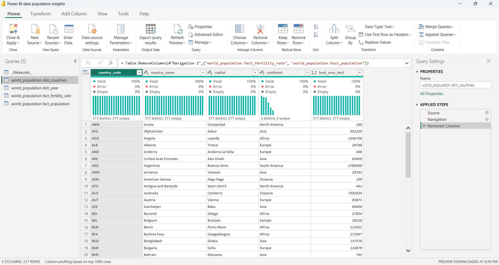
    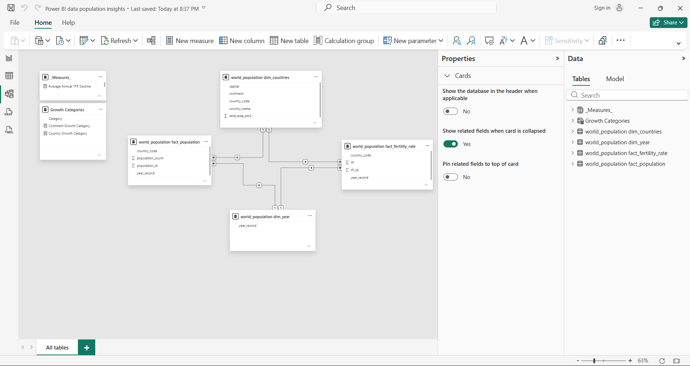
</p>

*The **star schema** shown on the screenshot was used as the core data model for this project, as it is widely recognized as the industry standard for analytical workloads. Its dimensional design simplifies relationships between tables, improves performance, and creates a solid foundation for efficient analysis in **Power BI**.*

</details>


<details>

<summary><strong>📐 DAX (Data Analysis Expressions)</strong></summary>  

DAX was used to build custom measures, KPIs, and analytical logic inside Power BI.  
Here are 6 of the most important measures used for KPIs and main analysis

### Countries Growth Rate YoY

```DAX
Countries Growth Rate YoY = 

VAR YearContext =
    VALUES('world_population dim_year'[year_record])

VAR IsYearFiltered =
    ISFILTERED('world_population dim_year'[year_record])

VAR YearTable =
    FILTER(
        VALUES('world_population dim_year'[year_record]),
        NOT ISBLANK(
            CALCULATE(
                SUM('world_population fact_population'[population_count])
            )
        )
    )

VAR Result =
    AVERAGEX(
        YearTable,
        VAR CurrentYear = 'world_population dim_year'[year_record]

        VAR CurrentValue =
            CALCULATE(
                SUM('world_population fact_population'[population_count])
            )

        VAR PreviousValue =
            CALCULATE(
                SUM('world_population fact_population'[population_count]),
                'world_population dim_year'[year_record] = CurrentYear - 1
            )

        VAR Growth =
            DIVIDE(CurrentValue - PreviousValue, PreviousValue)

        RETURN
            Growth
    )

RETURN
IF(
    IsYearFiltered,
    Result,
    CALCULATE(Result, ALL('world_population dim_year'[year_record]))
)
```

### Continents Average Growth Rate
```DAX
Continents avg growth rate = 
VAR StartDate =
    CALCULATE(
        MIN('world_population dim_year'[year_record]),
        ALL('world_population dim_year')
    )

VAR EndDate =
    MAXX(
        FILTER(
            VALUES('world_population dim_year'[year_record]),
            NOT ISBLANK(
                CALCULATE(
                    SUM('world_population fact_population'[population_count])
                )
            )
        ),
        'world_population dim_year'[year_record]
    )

VAR StartPopulation =
    CALCULATE(
        SUM('world_population fact_population'[population_count]),
        TREATAS({StartDate}, 'world_population dim_year'[year_record])
    )

VAR EndPopulation =
    CALCULATE(
        SUM('world_population fact_population'[population_count]),
        TREATAS({EndDate}, 'world_population dim_year'[year_record])
    )

VAR YearsBetween =
    EndDate - StartDate

RETURN
IF(
    YearsBetween > 0 &&
    NOT ISBLANK(StartPopulation) &&
    NOT ISBLANK(EndPopulation) &&
    StartPopulation > 0,
    POWER(
        DIVIDE(EndPopulation, StartPopulation),
        1 / YearsBetween
    ) - 1,
    BLANK()
)
```

### Peak Growth Rate
```DAX
Peak Growth Rate = 
VAR BaseTable =
    ADDCOLUMNS(
        SUMMARIZE(
            ALLSELECTED('world_population fact_population'),
            'world_population dim_countries'[country_name],
            'world_population dim_year'[year_record]
        ),
        "Growth", [Countries Growth Rate Avg]
    )

VAR FilteredTable =
    FILTER(
        BaseTable,
        NOT ISBLANK([Growth])
    )

RETURN
MAXX(
    FilteredTable,
    [Growth]
)
```

### Average TFR decline
```DAX
Average Annual TFR Decline = 

VAR YearTable =
    FILTER(
        VALUES('world_population dim_year'[year_record]),
        'world_population dim_year'[year_record] > 1960
    )

RETURN
AVERAGEX(
    YearTable,
    VAR CurrentYear = 'world_population dim_year'[year_record]

    VAR CurrentTFR =
        CALCULATE(
            AVERAGE('world_population fact_fertility_rate'[tfr]),
            'world_population dim_year'[year_record] = CurrentYear
        )

    VAR PreviousTFR =
        CALCULATE(
            AVERAGE('world_population fact_fertility_rate'[tfr]),
            'world_population dim_year'[year_record] = CurrentYear - 1
        )

    RETURN
        IF(
            NOT ISBLANK(CurrentTFR) &&
            NOT ISBLANK(PreviousTFR),
            PreviousTFR - CurrentTFR
        )
)
```

### Countries Growth Categorization
```DAX
Country Growth Category = 
VAR Growth = CALCULATE([Countries Growth Rate YoY])
RETURN
SWITCH(
    TRUE(),
    ISBLANK(Growth), BLANK(),

    Growth < 0, "Declining",

    Growth >= 0 && Growth < 0.002, "Stagnant",

    Growth >= 0.002 && Growth < 0.02, "Moderate Growth",

    Growth >= 0.02, "High Growth"
)
```

### People added by countries
```DAX
Most_population_added = 

VAR MinYear =
    MIN('world_population dim_year'[year_record])

VAR MaxYearWithData =
    MAXX(
        FILTER(
            ALLSELECTED('world_population dim_year'[year_record]),
            NOT ISBLANK(
                CALCULATE(
                    SUM('world_population fact_population'[population_count])
                )
            )
        ),
        'world_population dim_year'[year_record]
    )

VAR MinPop =
    CALCULATE(
        SUM('world_population fact_population'[population_count]),
        'world_population dim_year'[year_record] = MinYear
    )

VAR MaxPop =
    CALCULATE(
        SUM('world_population fact_population'[population_count]),
        'world_population dim_year'[year_record] = MaxYearWithData
    )

VAR YearCount =
    DISTINCTCOUNT('world_population dim_year'[year_record])

RETURN
    IF(
        YearCount = 1,
        MaxPop,
        MaxPop - MinPop
    )
```
</details>

---

## 🐍 Python

### Python was used as the main ETL engine (Divided in four sections for better maintainability).

### Purpose:
- Data extraction from both world-bank APIs
- Data cleaning and preprocessing
- Exploratory data analysis (EDA)
- Validation of data structure and quality
- Preparation for Neon DB data feeding
- Credentials protection
<br><br>


<details>
<summary><strong>📚 Python libraries used</strong></summary>

```python
# REQUIRED LIBRARIES
import os
import sys
import base64
import pandas as pd
import numpy as np
import textwrap
import requests
import pycountry
import psycopg2
from psycopg2.extras import execute_batch
import json
from tabulate import tabulate
from dotenv import load_dotenv
from pathlib import Path
from cryptography.fernet import Fernet

# GOOGLE AUTH AND SERVICE LIBRARIES
from email.mime.text import MIMEText
from google.oauth2.credentials import Credentials
from google.auth.transport.requests import Request
from googleapiclient.discovery import build
from google_auth_oauthlib.flow import InstalledAppFlow
```
</details>

<details>
<summary><strong>🔌 Connection Engine</strong></summary>

```Python
# DATABASE CONNECTION
load_dotenv()

# DATABASE CREDENTIALS
DB_HOST = os.getenv("DB_HOST")
DB_NAME = os.getenv("DB_NAME")
DB_USER = os.getenv("DB_USER")
DB_PASSWORD = os.getenv("DB_PASSWORD")
DB_PORT = os.getenv("DB_PORT")

IS_CI = os.getenv("GITHUB_ACTIONS", "false").lower() == "true"

SCOPES = ["https://www.googleapis.com/auth/gmail.send"]

# TOKEN ENCRYPTION AND SECURITY SECTION
ENCRYPTION_KEY = os.getenv("TOKEN_ENCRYPTION_KEY")

if not ENCRYPTION_KEY:
    raise ValueError("Missing TOKEN_ENCRYPTION_KEY")

fernet = Fernet(ENCRYPTION_KEY.encode())


def save_token(creds):

    encrypted_token = fernet.encrypt(
        creds.to_json().encode()
    )

# LOCAL BASED ENV AND FILES USE, SECTION
    if not IS_CI:
        with open("token.enc", "wb") as f:
            f.write(encrypted_token)

def load_token():
    try:
        # WEB-BASED ENV USE (GITHUB_ACTIONS), SECTION
        if IS_CI:
            encrypted_token = os.getenv("TOKEN_ENC")

            if not encrypted_token:
                return None

            encrypted_token = encrypted_token.encode()

        else:
            if not os.path.exists("token.enc"):
                return None

            with open("token.enc", "rb") as f:
                encrypted_token = f.read()

        # AUTHENTICATION SECTION FOR BOTH SCENARIOS (LOCAL-BASED / WEB-BASED)
        decrypted_token = fernet.decrypt(
            encrypted_token
        )

        token_info = json.loads(
            decrypted_token.decode()
        )

        return Credentials.from_authorized_user_info(
            token_info,
            SCOPES
        )

    except Exception as e:
        if not IS_CI:
            print(f"Token load failed {e}")
        return None

TO_EMAIL = os.getenv("GMAIL_RECIPIENT")
if not TO_EMAIL:
    raise ValueError("Missing GMAIL_RECIPIENT")

creds = load_token()

# REFRESH IF POSSIBLE WITH 3 ATTEMPTS IN CASE OF FAILURE
if creds and creds.expired and creds.refresh_token:

    refresh_success = False

    for attempt in range(1, 4):

        try:
            creds.refresh(Request())
            save_token(creds)
            refresh_success = True
            break

        except Exception:
            continue

    if not refresh_success:
        creds = None

        if not IS_CI:
            print("Credential refresh attempts failed")

# IF NO CREDS, THEN RUN THE LOGIN POP-UP
if not creds:

    if IS_CI:
        raise RuntimeError("Running in CI environment: interactive OAuth login is not allowed")

    flow = InstalledAppFlow.from_client_secrets_file(
        "gmail_credentials.json",
        SCOPES
    )

    creds = flow.run_local_server(port=0)

# SAVE TOKEN FOR REUSE
if not creds:
    raise RuntimeError("No valid Gmail credentials available")
save_token(creds)

# GMAIL SERVICE INITIALIZATION
service = build("gmail", "v1", credentials=creds)

# TESTING THE CONNECTION
cur = None
connection = None

try:
    connection = psycopg2.connect(
        host=DB_HOST,
        database=DB_NAME,
        user=DB_USER,
        password=DB_PASSWORD,
        port=DB_PORT
    )

    cur = connection.cursor()

    cur.execute("SELECT version();")
    engine_version = cur.fetchone()[0]

    cur.execute("SELECT CURRENT_DATABASE();")
    database_name = cur.fetchone()[0]

    cur.execute("SET search_path TO world_population;")
    cur.execute("SELECT CURRENT_SCHEMA();")
    schema_name = cur.fetchone()[0]

    # EMAIL CONTENT
    subject = "SUCCESSFUL Database Connection - Gmail API"

    body = (
        f"""The database has been successfully connected.
    
Engine version:
{engine_version}

Database and schema name:
{database_name} | {schema_name}
""")

    msg = MIMEText(textwrap.dedent(body))
    msg["to"] = TO_EMAIL
    msg["subject"] = subject

    raw = base64.urlsafe_b64encode(msg.as_bytes()).decode()

    # SEND EMAIL
    service.users().messages().send(
        userId="me",
        body={"raw": raw}
    ).execute()

    if not IS_CI:
        print("Success database connection, email has been sent")

except Exception as e:

    subject = "FAILED Database Connection - Gmail API"

    body = str(e)

    msg = MIMEText(body)
    msg["to"] = TO_EMAIL
    msg["subject"] = subject

    raw = base64.urlsafe_b64encode(msg.as_bytes()).decode()

    service.users().messages().send(
        userId="me",
        body={"raw": raw}
    ).execute()

    if not IS_CI:
        print("Failed database connection, email has been sent")
```
*This section of the script handles the remote connection to the Neon PostgreSQL database and the GMAIL service API initialization (AUTHENTICATION, TOKEN REFRESH, CREDENTIALS USE) for mailing notifications to ensure every single main process of the ETL pipeline is notified for alerting purposes in case of fails for database connection or GMAIL initialization, the fernet library was specifically used here to encrypt the GMAIL tokens and credentials for increased security even if github already does, this adds an extra protection layer*
</details>

<details>
<summary><strong>⚙️ Data extraction and cleaning engine</strong></summary>

```Python
# Hardcoded Country names standarization plus validations
# WORLD BANK APIs (POPULATION & FERTILITY RATE DATA)

indicator_map = {
    "population": "population_count",
    "fertility": "tfr"
}

apis = {
    "population":"https://api.worldbank.org/v2/country/all/indicator/SP.POP.TOTL?format=json&per_page=20000",
    "fertility":"https://api.worldbank.org/v2/country/all/indicator/SP.DYN.TFRT.IN?format=json&per_page=20000"
}

results = {}
cleaned_data = {}

api_debug = {}

try:
    for api_name, url in apis.items():
        current_api = api_name

        response = None
        
        for attempt in range(1, 4):
            try:
                response = requests.get(url, timeout=30)
                response.raise_for_status()
                break

            except requests.RequestException:
                if attempt == 3:
                    if not IS_CI:
                        print("API failed, 3 attempts already completed")
                    raise

        api_debug[api_name] = {
            "url": url,
            "status_code": response.status_code,
            "headers": dict(response.headers),
            "response_preview": response.text[:450],
            "response_length": len(response.text)
        }

        try:
            json_data = response.json()
        except ValueError:
            raise ValueError("WORLD BANK API ERROR: Invalid JSON response (likely HTML, empty response, or malformed API request)")

        if not (
            isinstance(json_data, list)
            and len(json_data) > 1
            and isinstance(json_data[1], list)
    ):
            raise ValueError(f"Invalid structure for {api_name}")

        results[api_name] = json_data[1]

except Exception as api_issues:

    subject = "API - ISSUES"

    body = f"""ETL stopped due to API failure.

ERROR MESSAGE:
{api_issues}

FAILED API:
{current_api if 'current_api' in locals() else 'unknown'}

API DEBUG:
{api_debug.get(current_api, {"error": "No debug info available"})}

Response Length:
{api_debug.get(current_api, {}).get("response_length", "unknown")}
"""


    msg = MIMEText(textwrap.dedent(body))
    msg["to"] = TO_EMAIL
    msg["subject"] = subject

    raw = base64.urlsafe_b64encode(msg.as_bytes()).decode()

    service.users().messages().send(
        userId="me",
        body={"raw": raw}
    ).execute()

    if not IS_CI:
        print("API ISSUES")
    sys.exit("ETL STOPPED")

# DATA CLEANING & TRANSFORMATION
def clean_world_bank_data(data, column_name):

    df = pd.json_normalize(data)

    df = df[["country.value", "countryiso3code", "date", "value"]]

    df = df.rename(columns={
    "country.value": "country_name",
    "countryiso3code": "country_code",
    "date": "year_record",
    "value": column_name
})

    inclusion = {"XKX", "CHI"}
    valid_country_codes = {country.alpha_3 for country in pycountry.countries}
    valid_country_codes = valid_country_codes.union(inclusion)

    df = df[df["country_code"].isin(valid_country_codes)]

    df["country_name"] = df["country_name"].astype("string").str.strip()
    df["country_code"] = df["country_code"].str.strip().str.upper()

    df["year_record"] = pd.to_numeric(df["year_record"], errors="coerce").astype("Int64")
    df[column_name] = pd.to_numeric(df[column_name], errors="coerce")

    return df

# CLEANING FOR BOTH APIs DATA REUSING THE FUNCTION "clean_world_bank_data".
for api_name, data in results.items():

    column_name = indicator_map[api_name]

    cleaned_data[api_name] = clean_world_bank_data(data, column_name)

population_df = cleaned_data["population"]
fertility_df = cleaned_data["fertility"]

country_names = {
"Venezuela, RB": "Venezuela",
"Iran, Islamic Rep.": "Iran",
"Korea, Rep.": "South Korea",
"Korea, Dem. People's Rep.": "North Korea",
"Egypt, Arab Rep.": "Egypt",
"Russian Federation": "Russia",
"Syrian Arab Republic": "Syria",
"Yemen, Rep.": "Yemen",
"Viet Nam": "Vietnam",
"Tanzania, United Republic of": "Tanzania",
"St. Martin (French part)": "French St. Martin",
"Sint Maarten (Dutch part)": "Dutch Sint Maarten",
"Puerto Rico (US)": "Puerto Rico",
"Micronesia, Fed. Sts.": "Micronesia",
"Moldova, Republic of": "Moldova",
"Bahamas, The": "Bahamas",
"Virgin Islands, British": "British Virgin Islands",
"Virgin Islands (U.S.)": "American Virgin Islands",
"West Bank and Gaza": "Palestine",
"Congo, Dem. Rep.": "Democratic Republic of the Congo",
"Congo, Rep.": "Republic of the Congo",
"Somalia, Fed. Rep.": "Somalia",
"Slovak Republic": "Republic of Slovakia",
}

def rename_countries(country):
    if pd.isna(country):
        return country
    country = str(country).strip()
    return country_names.get(country, country)


population_df["country_name"] = population_df["country_name"].apply(rename_countries)
fertility_df["country_name"] = fertility_df["country_name"].apply(rename_countries)

#DATA ENRICHEMENT

def get_project_root():

    # IF CI ENVS
    env_root = os.getenv("PROJECT_ROOT")
    if env_root:
        return Path(env_root)

    # IF SCRIPT FILE
    if "__file__" in globals():
        return Path(__file__).resolve().parent

    # IF NOTEBOOK FALLBACK
    return Path.cwd()

BASE_DIR = get_project_root()

file_path = BASE_DIR / "cleaned_datasets" / "country_enrichment.csv"

if not file_path.exists():
    msg = f"Missing file at: {file_path}"

    if not IS_CI:
        print(msg)
        
    raise FileNotFoundError(msg)

country_enrichment = pd.read_csv(file_path)
enrichment_details = country_enrichment[["country_code", "capital", "land_area_km2", "continent"]]
enrichment_details["country_code"] = enrichment_details["country_code"].str.strip().str.upper()

try:
    population_df = population_df.merge(enrichment_details, on=["country_code"], how="left")
    population_df = population_df[["country_name", "country_code", "year_record", "population_count", "land_area_km2", "capital", "continent"]]
    fertility_df = fertility_df[["country_name", "country_code", "year_record", "tfr"]]
except Exception as mergeissue:
    if not IS_CI:
        print(mergeissue) 
    subject = "Countries_Enrichment - Gmail API"

    body = f"""The enrichmenet has failed due to.
    
Error:
{mergeissue}
"""

    msg = MIMEText(textwrap.dedent(body))
    msg["to"] = TO_EMAIL
    msg["subject"] = subject

    raw = base64.urlsafe_b64encode(msg.as_bytes()).decode()

    # SEND EMAIL
    service.users().messages().send(
        userId="me",
        body={"raw": raw}
    ).execute()


#FINAL DATA CLEANING
population_df["capital"] = population_df["capital"].astype("string").str.strip().str.title()
population_df["continent"] = population_df["continent"].astype("string").str.strip().str.title()
population_df["land_area_km2"] = pd.to_numeric(population_df["land_area_km2"], errors="coerce")

population_df["population_count"] = pd.to_numeric(population_df["population_count"], errors="coerce").astype("Int64")
fertility_df["tfr"] = pd.to_numeric(fertility_df["tfr"], errors="coerce")

#QUICK DATA VALIDATION
if not IS_CI:
    print("POPULATION DATA")
    print(population_df.head(10))

    print("\nFERTILITY DATA:")
    print(fertility_df.head(5))
```
*This part of the code was the main ⚙️ engine and most important one that made the data-cleaning and filtering work possible for both API datasets, this part of the whole code handles errors and notifies about them also. It is also well known that hardcoding values directly onto the code is not a good practice, however; an exeption was done as the pycountry library is outdated, it failed some times to correct the country names, as a result, no other option was left than harcoding some countries value for renaming and filtering purposes. A merge with a local dataset was made, which was also obtained via a python script aside the main one as the world bank APIs do not serve the desired details such as Capitals, Continents and Terrytory km2 all in the same APIs requests*
</details>

<details>
<summary><strong>🫕 Database table values preparation</strong></summary>

```Python
#PREPARING DATA FOR DIM_YEAR VALUES INSERTION

# PANDAS NAN VALUES HANDLING
def to_pg_value(x):
    if pd.isna(x):
        return None
    if isinstance(x, np.generic):
        return x.item()
    return x


def df_to_pg_records(df):
    return [
        tuple(to_pg_value(x) for x in row)
        for row in df.itertuples(index=False, name=None)
    ]

dim_year_table = (population_df[["year_record"]].drop_duplicates().dropna(subset=["year_record"]).assign(year_record=lambda df:pd.to_numeric(df["year_record"], errors="raise")))
dim_year_table_values = df_to_pg_records(dim_year_table)

dim_year_insert_query ="""
INSERT INTO dim_year (year_record)
VALUES (%s)
ON CONFLICT (year_record) DO NOTHING;
"""

dim_countries_table = population_df[["country_name", "country_code", "capital", "continent", "land_area_km2"]].drop_duplicates().dropna(subset=["country_code"])
dim_countries_table_values = df_to_pg_records(dim_countries_table)

dim_countries_insert_query = """
INSERT INTO dim_countries (country_name, country_code, capital, continent, land_area_km2)
VALUES (%s, %s, %s, %s, %s)
ON CONFLICT (country_code)
DO UPDATE SET
    country_name = EXCLUDED.country_name,
    capital = EXCLUDED.capital,
    continent = EXCLUDED.continent,
    land_area_km2 = EXCLUDED.land_area_km2
WHERE
    dim_countries.country_name IS DISTINCT FROM EXCLUDED.country_name
    OR dim_countries.capital IS DISTINCT FROM EXCLUDED.capital
    OR dim_countries.continent IS DISTINCT FROM EXCLUDED.continent
    OR dim_countries.land_area_km2 IS DISTINCT FROM EXCLUDED.land_area_km2;
    """

fact_population_table = population_df[["country_code", "year_record", "population_count"]].drop_duplicates(subset=["country_code", "year_record"]).dropna(subset=["year_record", "country_code"])
fact_population_table_values = df_to_pg_records(fact_population_table)

fact_population_insert_query ="""
INSERT INTO fact_population
(country_code, year_record, population_count)
VALUES (%s, %s, %s)

ON CONFLICT (country_code, year_record)

DO UPDATE
SET population_count = EXCLUDED.population_count

WHERE fact_population.population_count
IS DISTINCT FROM EXCLUDED.population_count;
"""

fact_fertility_rate_table = fertility_df[["country_code", "year_record", "tfr"]].drop_duplicates(subset=["country_code", "year_record"]).dropna(subset=["year_record", "country_code"])
fact_fertility_rate_table_values = df_to_pg_records(fact_fertility_rate_table)

fact_fertility_rate_insert_query ="""
INSERT INTO fact_fertility_rate
(country_code, year_record, tfr)
VALUES (%s, %s, %s)

ON CONFLICT (country_code, year_record)

DO UPDATE
SET tfr = EXCLUDED.tfr

WHERE fact_fertility_rate.tfr
IS DISTINCT FROM EXCLUDED.tfr;"""
```
*The section is on charge of the data preparation per Neon PostgreSQL tables, the values are well cleaned and formated to avoid database and datatyoe issues to maintain the data integrity. The ```ON CONFLICT () DO UPDATE``` query purpose was designed to avoid new data overwrite every time the script runs, it just update the missing data or overwrite the existent ones, which is a good measure and the best approach for ETL pipelines, sometimes the World Bank organization update or correct their values, so this ensure that only those different values to the existen ones are inserted to keep memory and speed efficiency*
</details>

<details>
<summary><strong>💾 Database values insertion and storage engine</strong></summary>

```Python
# EMAIL HEADERS
headers = ["Country", "Code", "Total Years Recorded"]

try:
   # LOAD DIM_YEAR
    execute_batch(cur,dim_year_insert_query, dim_year_table_values, page_size=1000)

    # LOAD DIM_COUNTRIES
    execute_batch(cur, dim_countries_insert_query, dim_countries_table_values, page_size=1000)
    
    #LOAD FACT_POPULATION 
    execute_batch(cur, fact_population_insert_query, fact_population_table_values, page_size=1000)

    #LOAD FACT_FERILTITY_RATE
    execute_batch(cur, fact_fertility_rate_insert_query, fact_fertility_rate_table_values, page_size=1000)

    #COMMIT THE INSERTION
    connection.commit()

    # DIM_YEAR QUERY
    cur.execute("SELECT COUNT(*) AS years_count FROM dim_year")
    dim_year_query = cur.fetchone()[0]
    cur.execute("SELECT MIN(year_record) FROM dim_year")
    min_dim_year = cur.fetchone()[0]
    cur.execute("SELECT MAX(year_record) FROM dim_year")
    max_dim_year = cur.fetchone()[0]

    # DIM_COUNTRIES QUERY
    cur.execute("SELECT COUNT(country_code) AS total_countries FROM dim_countries")
    dim_countries_query = cur.fetchone()[0]

    # FACT_POPULATION QUERY
    cur.execute("""SELECT
                dc.country_name AS Countries,
                dc.country_code AS Code,
                COUNT(fp.year_record) AS total_years_recorded
                FROM dim_countries AS dc
                LEFT JOIN fact_population AS fp
                ON dc.country_code = fp.country_code 
                GROUP BY dc.country_name, dc.country_code
                ORDER BY total_years_recorded DESC
                """)

    # EMAIL PRETTY PRINT :)
    fact_population_query = cur.fetchall()
    population_summary = tabulate(fact_population_query, headers=headers, tablefmt="grid")

    # FACT_FERTILITY_RATE QUERY
    cur.execute("""SELECT
                dc.country_name AS Countries,
                dc.country_code AS Code,
                COUNT(ff.year_record) AS total_years_recorded
                FROM dim_countries AS dc
                LEFT JOIN fact_fertility_rate AS ff
                ON dc.country_code = ff.country_code 
                GROUP BY dc.country_name, dc.country_code
                ORDER BY total_years_recorded DESC
                """)

    # EMAIL PRETTY PRINT :)
    fact_fertility_query = cur.fetchall()
    fertility_summary = tabulate(fact_fertility_query, headers=headers, tablefmt="grid")

    # EMAIL NOTIFICATION OF THE SUCCESSFUL INSERTION WiTH THE CONFIRMATION OF THE NUMBER OF VALUES IN THE TABLE
    subject = "SUCCESSFUL DATABASE INSERTION"
    body = f"""
    
The YEAR table has been successfully updated.
Total years count: {dim_year_query}
MIN year: {min_dim_year}
MAX year: {max_dim_year}

The COUNTRIES table has been successfully updated.
Total countries count: {dim_countries_query}

The POPULATION table has been successfully updated.
{population_summary}

The FERTILITY table has been successfully updated.
{fertility_summary}
"""

    msg = MIMEText(textwrap.dedent(body))
    msg["to"] = TO_EMAIL
    msg["subject"] = subject

    raw = base64.urlsafe_b64encode(msg.as_bytes()).decode()
    service.users().messages().send(
    userId="me",
    body={"raw": raw}
    ).execute()

    if not IS_CI:
        print("SUCCESSFUL DATABASE INSERTION. EMAIL HAS BEEN SENT")

except Exception as e:
    # ROLLBACK TRANSACTION AND SEND FAILURE NOTIFICATION
    connection.rollback()

    subject = "FAILED VALUES INSERTION"
    body = (
    f"""Failed insertions due to error message:

{e}"""
    )

    msg = MIMEText(textwrap.dedent(body))
    msg["to"] = TO_EMAIL
    msg["subject"] = subject

    raw = base64.urlsafe_b64encode(msg.as_bytes()).decode()
    service.users().messages().send(
    userId="me",
    body={"raw": raw}
    ).execute()

    if not IS_CI:
        print(f"""Error occurred: {e}. email sent""")
    raise e
    
    # AFTER THE SCRIPT RUNS SUCCESSFULLY, CLOSE THE DB CONNECTION
finally:

    if cur is not None:
        cur.close()

    if connection is not None:
        connection.close()
```
*This section handles the final stage of the entire ETL pipeline, this insert the data values into their corresponding tables withing the Neon database, having them securely stored and ready for Power BI dashboard feeding. The trick here is that the process atomicity was kept following the ALL inserted if all goes well, or NONE is inserted if the script or data breaks to ensure no data is partially loaded, finally the reomote connection to the database was closed as a good practice on the final stage of the whole script*
</details>


---

## 💻 Visual Studio Code

### Used as the main development environment for:  

- Python scripting
- Jupyter Notebook (.ipynb) execution
- Virtual environment (venv) management
- Code debugging and testing
- Data workflow organization

### Key Benefits:  

- Lightweight data development environment
- Integrated terminal for Python execution
- Seamless notebook + script workflow
- Better project structure management
<br><br>

<details>
<summary><strong>Microsoft Visual Studio Code, workspace structure</strong></summary>
<br><br>

<p align="left">
    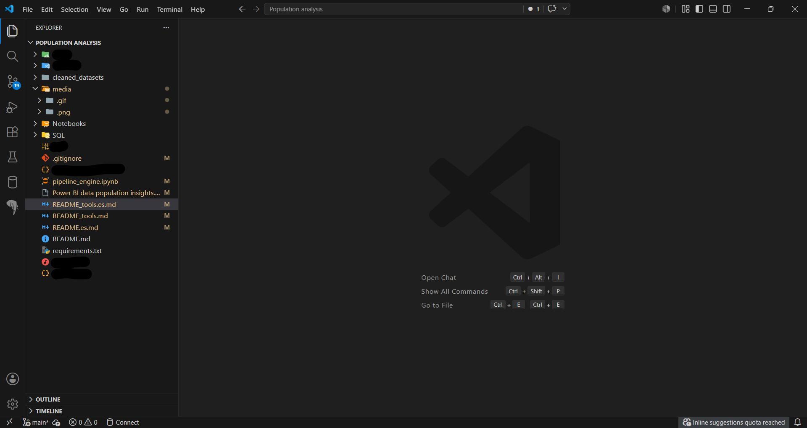
</p>

*The workspace was designed to centralize the entire data analytics workflow, providing a unified environment for data ingestion, transformation, validation, storage, and reporting. A dedicated Python environment was implemented to isolate dependencies, avoid package conflicts, and maintain a clean development space. Using this setup, .ipynb notebooks were created and edited efficiently, enabling smooth development of the data processing pipeline. This structure significantly improved workflow efficiency, making it easy to move between source data, code, and processed outputs in one unified workspace, with minimal friction during development and analysis.*

</details>

<details>
<summary><strong>Microsoft Visual Studio Code, world-bank population data cleaning python script</strong></summary>
<br><br>

<p align="left">
    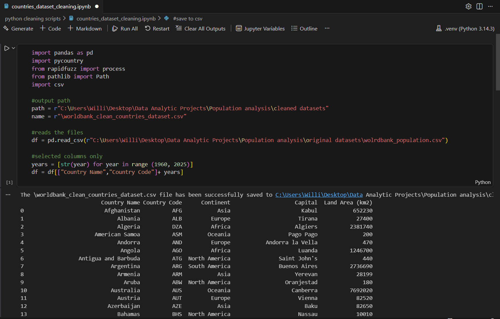
</p>

</details>


<details>
<summary><strong>Microsoft Visual Studio Code, world-bank fertility rate data cleaning python script</strong></summary>
<br><br>

<p align="left">
    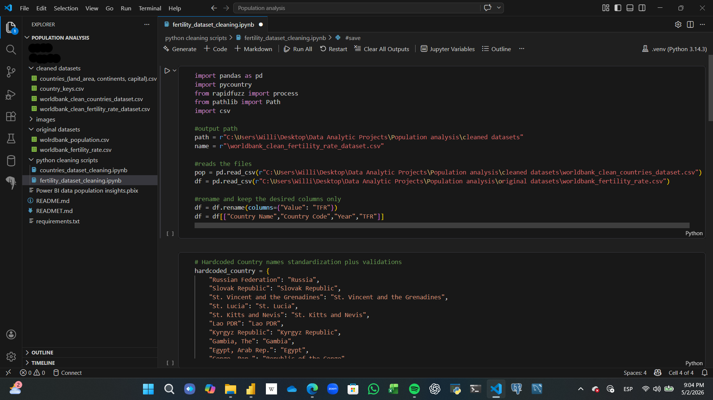
</p>

</details>
<br>

---

## 📝 Markdown Language for Documentation

### Used throughout the project for:

* Structuring project documentation
* Presenting technical explanations clearly
* Organizing code snippets and workflow sections
* Documenting methodology, findings, and project decisions
* Improving overall readability and project presentation

### Key Benefits:

* Clean and professional project documentation
* Easy formatting for headers, lists, tables, and code blocks
* Better organization of technical content
* Improved readability for viewers and collaborators
* Effective presentation of the project’s workflow and insights
<br><br>


<details>
<summary><strong>Project documentation development using the Markdown Language</strong></summary>  
<br><br>

<p align="left">
    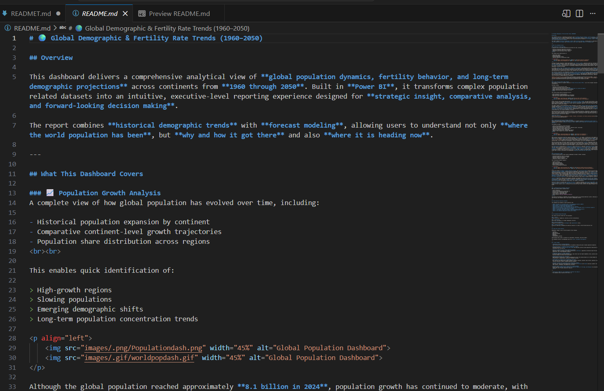
</p>

*This document showcases the development of the World Population Dashboard, highlighting its core insights, dashboard preview, and a concise analytical walkthrough for quick review. You may also notice a blend of pure Markdown and **HTML** syntax throughout the documentation an intentional choice made to achieve greater control over rendering and layout in sections where standard Markdown has limitations.*
<br><br>

<p align="left">
    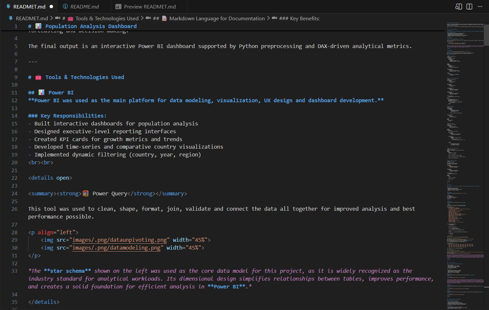
</p>

*This is where the project’s tools implementation walkthrough comes to life. A dedicated Markdown documentation was intentionally created for the tools used throughout this project to maintain a clean and structured setup. Instead of combining every technology into one large section, each tool is documented independently, allowing users to navigate directly to the information relevant to them.*
</details>
<br>

---

## 🌐 [Neon Serverless PostgreSQL](https://neon.com/)

### Implemented as a core component for:

* Designing and implementing the relational database architecture
* Storing and managing transformed data in a centralized cloud-hosted PostgreSQL database
* Supporting the ETL pipeline’s loading phase through batch inserts and transactional operations
* Enabling scalable remote access to the database from local and automated environments
* Serving as the project’s analytical data warehouse for downstream reporting
* Optimizing query performance through indexing and relational design best practices
* Persisting historical population and fertility datasets for longitudinal analysis
* Feeding the final dashboard and analytical visualizations with structured, query-ready data
* Allowing future extensibility for additional demographic indicators and datasets
* Managing normalized fact and dimension tables following a star-schema-inspired structure

### Key Benefits:  

* Autoscaling: Compute resources automatically scale up or down depending on workload.
* Scale-to-zero: Databases can suspend when idle and restart on demand.
* Helps reduce infrastructure cost for low-traffic apps, side projects, or dev environments.
* Usage-based pricing: You pay mainly for actual compute and storage usage instead of fixed server capacity.
* Prevents overprovisioning common in traditional PostgreSQL hosting.
* Separation of compute and storage: Neon decouples storage from compute, allowing elastic scaling and faster infrastructure operations.
* Makes branching and restores much faster than standard PostgreSQL deployments.
* Database branching: You can create instant database branches similar to Git branches.
* Built-in connection pooling: Includes PgBouncer-style pooling automatically.
* Restore databases to previous states quickly without complex backup and point-in-time recovery
* Fully compatible with PostgreSQL
<br><br>

<details>
<summary><strong>🎛️ Neon main page UI</strong></summary>  
<br><br>

<p align="left">
    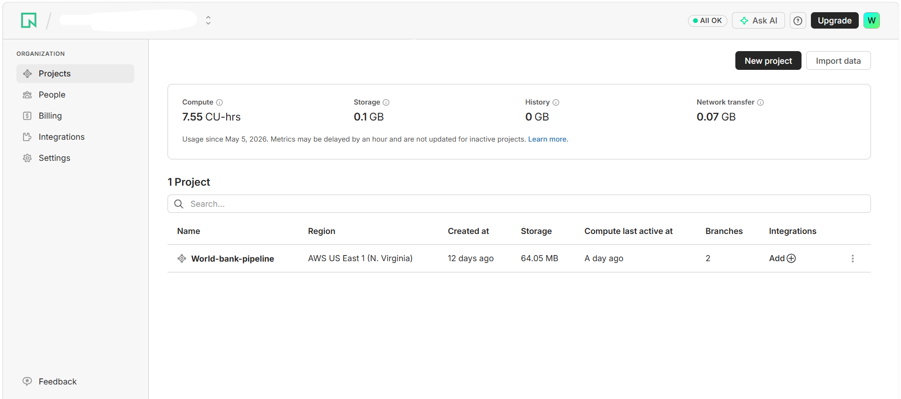
</p>

*From this UI all the database can be managed easily; the connections, users, resources and more...*
</details>

<details>
<summary><strong>🖇️ Neon Branches</strong></summary>  
<br><br>


<p align="left">
    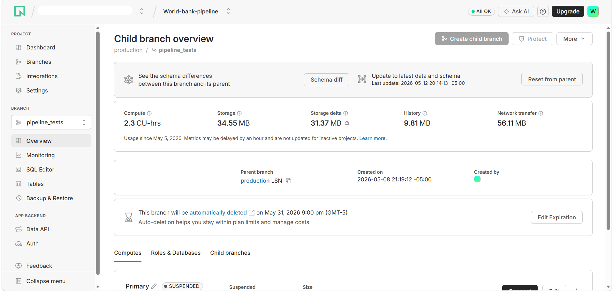
</p>

*As Neon supports database branching functionality similar to Git, a separate development branch was created for testing purposes throughout the pipeline engine development process. This isolated environment was used to validate ETL logic, test transformations, verify data consistency, and perform quality assurance checks before deployment to the production database and GitHub repository.*

*The branching workflow enabled safe prototyping and iterative development without affecting the production environment, ensuring the reliability, integrity, and stability of the final pipeline before release.*
</details>


<details>
<summary><strong>🔷 Neon Schema</strong></summary>  
<br><br>


<p align="left">
    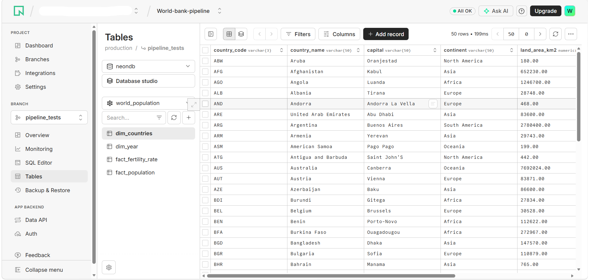
</p>

*From here we have access to all the schema level configurations, a simple UI for easy use where the tables can be altered, the schema changed, constraints added/ removed or altered and the table values modified.*
</details>

<details>
<summary><strong>🔃 Neon Queries</strong></summary>  
<br><br>


<p align="left">
    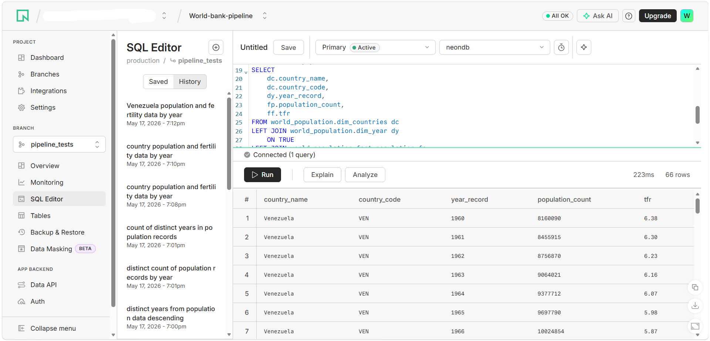
</p>

*On this section, all the available tables can be queried to see their data.*
</details>

---


## 🐘 PostgreSQL

### Applied across the project for:

* Creating schemas, tables, constraints, primary keys, and foreign key relationships
* Supporting data validation and integrity through PostgreSQL constraints and type enforcement
* User and account management
* Quick data validations and exploratory query testing
* Quick schema alterations and iterative database refinements during development
* Roles and users creation for access control and permission management
* Full schema visualization
* Supporting scalable cloud-hosted database operations through integration with Neon
* Neon remote connection testing

### Key Benefits:

* Strong relational database capabilities for structured analytical workloads
* High data integrity and reliability through ACID-compliant transactions
* Robust support for constraints, relationships, and type enforcement
* Excellent performance for complex SQL queries, joins, and aggregations
* Scalable architecture suitable for large historical demographic datasets
* Advanced indexing and query optimization capabilities
* Seamless integration with Python-based ETL pipelines and analytical tools
* Strong compatibility with business intelligence platforms such as Power BI
* Flexible schema management for iterative development and rapid prototyping
* Support for role-based access control and secure database administration
* Efficient handling of normalized relational data models
* Reliable cloud deployment support through Neon
* Branching capabilities in Neon enabled isolated testing and development environments
* Open-source ecosystem with extensive community support and documentation
* Well-suited for data warehousing, analytics, and ETL-oriented projects
* Strong transactional consistency for production-grade data pipelines
<br><br>

<details>
<summary><strong>🔷 PostgreSQL Schema Creation</strong></summary>  
<br><br>

<p align="left">
    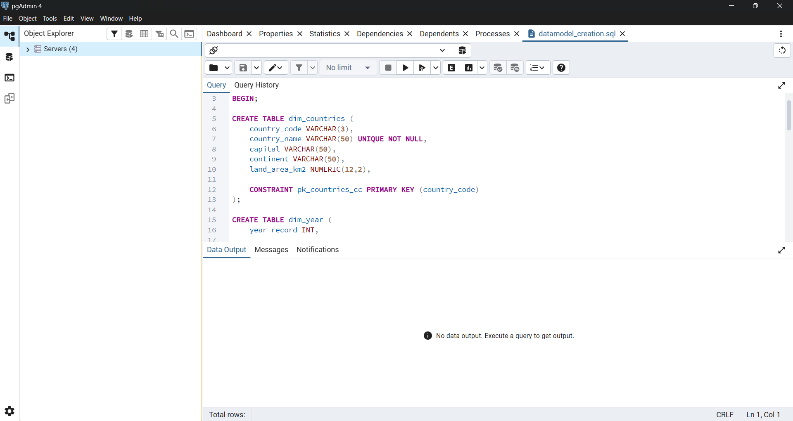
</p>

*Here, using PostgreSQL PgAdmin the schema, tables and users were created, managed and alter to have a proper modeling design that will hold the data for its use.*
</details>


<details>
<summary><strong>🔷 PostgreSQL Schema Visualization</strong></summary>  
<br><br>


<p align="left">
    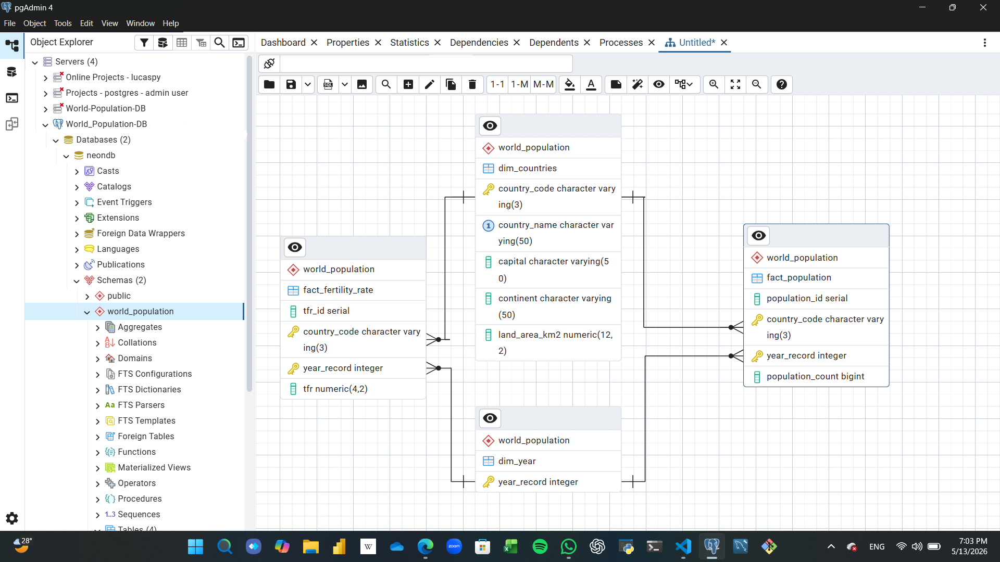
</p>

*Here we can have a better and clear schema structure with this PostgreSQL built-in feature that allows users to visualize the schema.*
</details>

---

## ☁️ [Google Cloud](https://cloud.google.com/)

### Played a central role in:

* Hosting and managing the project's API integrations
* Enabling and configuring the Gmail API for automated email notifications
* Managing OAuth 2.0 authentication credentials
* Monitoring API traffic, latency, and error rates
* Tracking API quota consumption and usage metrics
* Securing access through OAuth consent and credential management
* Providing centralized administration for cloud-based services used by the application

### Key Benefits:

* Secure OAuth 2.0 authentication for Gmail integration
* Centralized management of APIs and project credentials
* Built-in monitoring for API performance and reliability
* Usage analytics to help troubleshoot and optimize API consumption
* Quota management to prevent service interruptions
* Scalable cloud infrastructure without requiring server maintenance
* Simplified integration with Google's ecosystem and developer tools
<br><br>

<details>
<summary><strong>Google Cloud Platform Gmail API Metrics</strong></summary>  
<br><br>

<p align="left">
    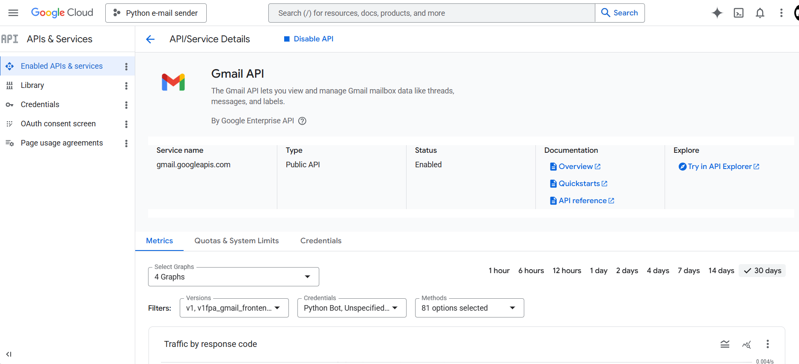
</p>

<p align="left">
    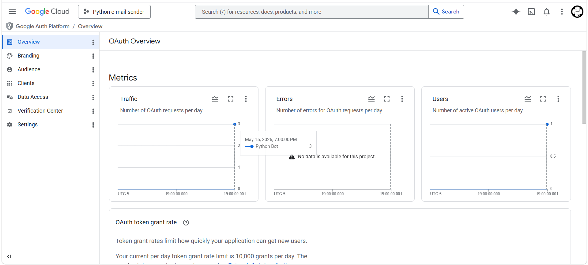
</p>

<p align="left">
    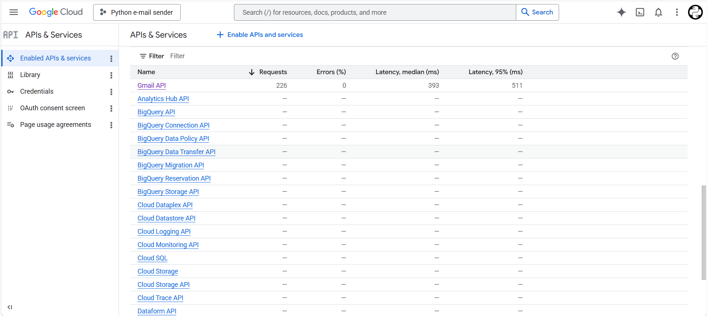
</p>

<p align="left">
    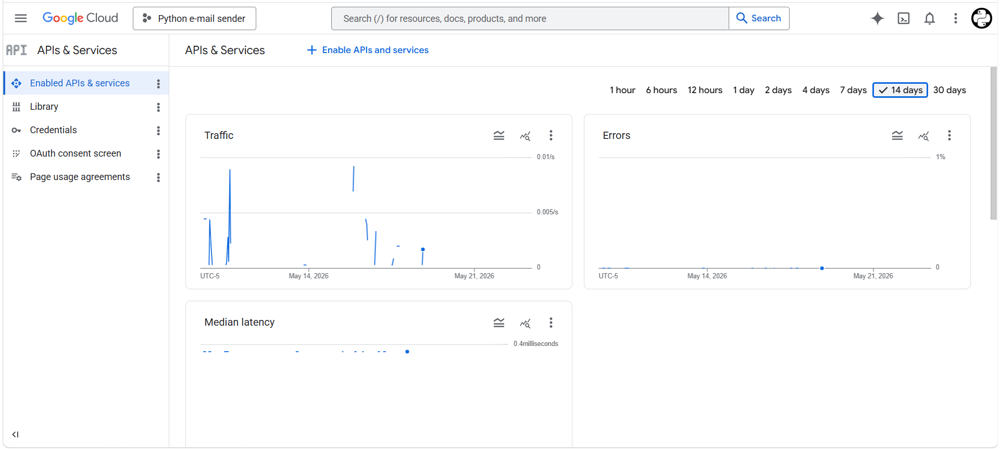
</p>

<p align="left">
    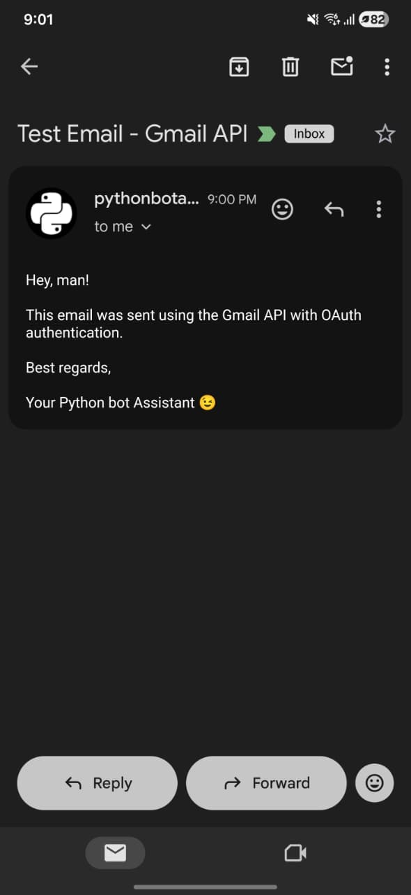
    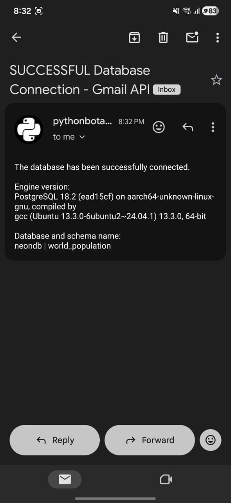
</p>

*On this section, all available Gmail API metrics and service status information were reviewed and monitored to verify API availability, response behavior, latency, traffic patterns, quota consumption, and error rates. Additionally, multiple validation tests were performed to confirm successful OAuth 2.0 authentication, API connectivity, email delivery functionality, credential usage, token refresh operations, and overall integration reliability throughout the development and testing phases of this project.*
</details>

---

## 💾 Git

### Adopted to manage and support:

* Version control throughout the entire project lifecycle
* Source code tracking and change history management
* Feature development through incremental commits
* Safe experimentation and rollback capabilities
* Collaboration-ready workflows and repository organization
* ETL pipeline development, testing, and maintenance
* Documentation versioning and updates
* Project backup and source code preservation
* Release preparation and deployment tracking
* Change auditing and development traceability

### Key Benefits:

* Complete history of code and project changes
* Easy rollback to previous stable versions when needed
* Improved code organization and development workflow
* Enhanced project reliability through version tracking
* Better debugging by identifying when changes were introduced
* Reduced risk of accidental data or code loss
* Support for branching and isolated feature development
* Facilitates collaboration and code review processes
* Industry-standard version control practices
* Improved maintainability and long-term project management
* Increased transparency and traceability of development activities
* Seamless integration with repository hosting platforms such as GitHub
<br><br>

<details>
<summary><strong>📥 GIT inizialization and Status</strong></summary>  
<br><br>

<p align="left">
    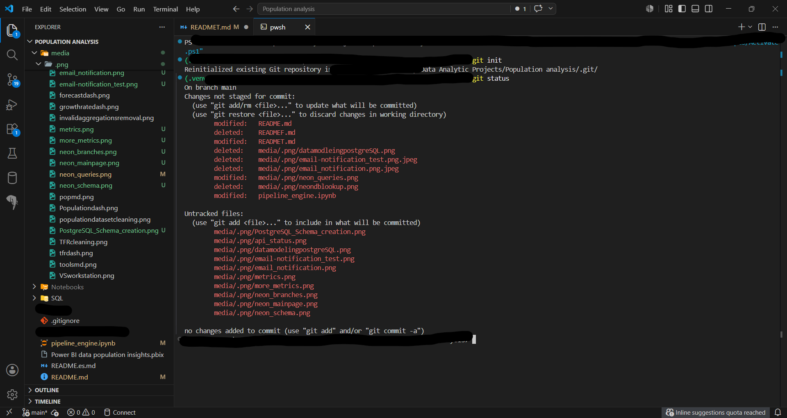
</p>

*Git was used to initialize and manage the project's version control system. Throughout development, the `git status` command was employed to inspect the repository's current state, identify modified files, detect newly created untracked files, and verify staged changes before commits.*
</details>

<details>
<summary><strong>🗃️ GIT Log</strong></summary>  
<br><br>

<p align="left">
    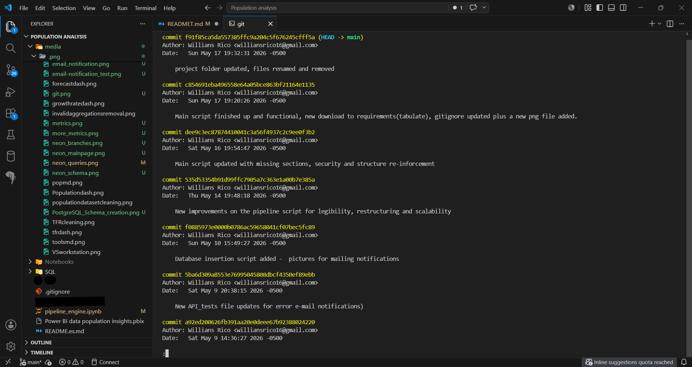
</p>

*The `git log` command was leveraged to review commit history, validate successful commits, track project evolution, and maintain a complete audit trail of all source code and documentation changes.*
</details>

<details>
<summary><strong>📨 GIT Add and Commit</strong></summary>  
<br><br>

<p align="left">
    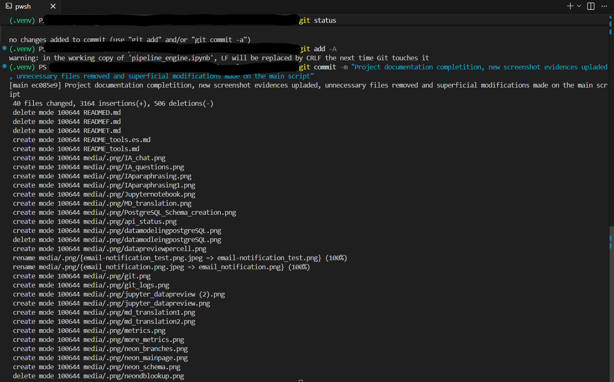
</p>

*The `git add` command was used to stage relevant files, while `git commit -m "<message>"` was used to create documented snapshots of the project's progress.*
</details>

---

## 🗒️ Jupyter Lab

### Used to power the following components of the project:

* New code lines isolagtion and testing
* Interactive development and testing of ETL processes
* Step-by-step data exploration and validation
* Data cleaning, transformation, and preprocessing workflows
* Execution of Python code cells for incremental debugging
* Verification of API responses and data quality checks
* Analysis of intermediate datasets before database loading
* Rapid prototyping of data extraction and transformation logic
* Documentation of development processes through notebook cells
* Validation of PostgreSQL queries and database interactions 

### Key Benefits:

* Interactive code execution without running the entire script
* Faster debugging and troubleshooting during development
* Improved visibility of intermediate variables and datasets
* Efficient testing of data transformations and business logic
* Simplified data exploration and quality assurance processes
* Ability to combine code, outputs, and documentation in a single workspace
* Streamlined ETL development through cell-based execution
* Enhanced productivity when working with large datasets and APIs
* Seamless integration with Visual Studio Code through the Jupyter extension
<br><br>

<details>
<summary><strong>👀 Jupyter Lab Cells Data Visualization</strong></summary>  
<br><br>

<p align="left">
    
</p>

<p align="left">
    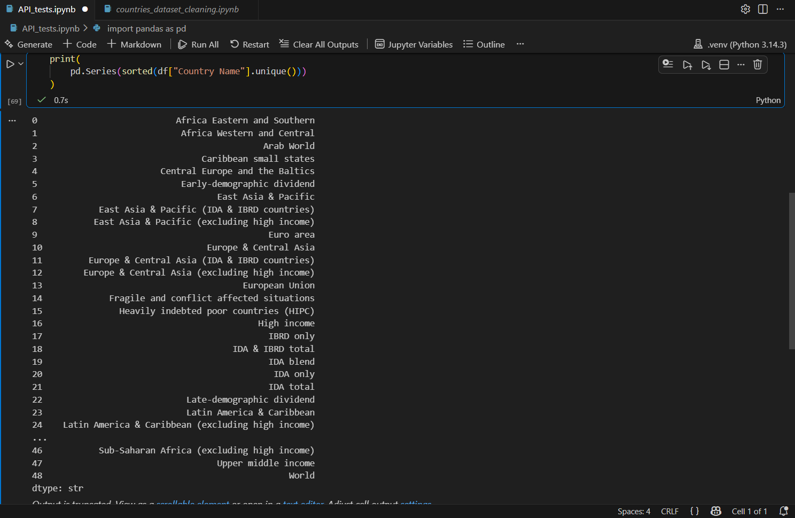
</p>

<p align="left">
    
</p>

<p align="left">
    
</p>

<p align="left">
    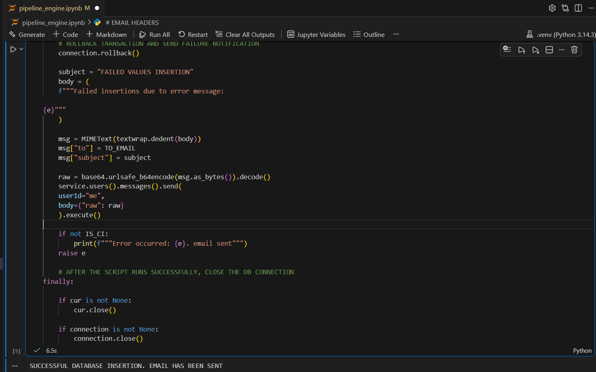
</p>

*As illustrated in the screenshots above, Jupyter Cells were used throughout the development process to visualize data and execute code incrementally. The notebook interface provides controls that allow individual cells to be executed independently or all cells to be run sequentially, which facilitated isolated testing of specific code segments before integrating them into the production script. This approach helped improve stability by validating functionality in smaller, controlled units.*

*Additionally, multiple cells were used to organize the script into logical sections, making debugging, maintenance, and future updates more efficient. The cell-based workflow also facilitated the inspection of variables, API responses, data transformations, and database operations during development. Furthermore, the Jupyter environment was configured to use the project's Python virtual environment (venv), ensuring that all required dependencies, libraries, and package versions remained isolated from the system-wide Python installation and consistent with the production development environment. This helped maintain reproducibility and avoid dependency conflicts throughout the project lifecycle.*
</details>

---

## 🤖 A.I chats

### Configured and utilized for:

* Translating project documentation from English to Spanish while preserving technical terminology and formatting
* Conducting data feasibility and availability assessments prior to implementation
* Researching APIs, authentication methods, endpoints, quotas, and integration requirements
* Exploring technical documentation, libraries, frameworks, and development tools used throughout the project
* Assisting with troubleshooting, debugging, and validation of implementation approaches
* Reviewing best practices related to ETL development, database design, and API integrations
* Supporting the understanding of PostgreSQL, Git, GitHub Actions, and cloud-based services documentation

### Key Benefits:

* Faster documentation translation with reduced manual effort
* Accelerated research and information gathering processes
* Improved productivity during technical investigations
* Quicker access to implementation examples and best practices
* Enhanced understanding of unfamiliar technologies and services
* Reduced development time when evaluating APIs and external tools
* Simplified interpretation of technical documentation and specifications
* Faster troubleshooting through guided explanations and recommendations
* Increased efficiency when validating project architecture and design decisions
* Centralized assistance for development, documentation, and research activities
<br><br>

<details>
<summary><strong>🔍 API search</strong></summary>  
<br><br>

<p align="left">
    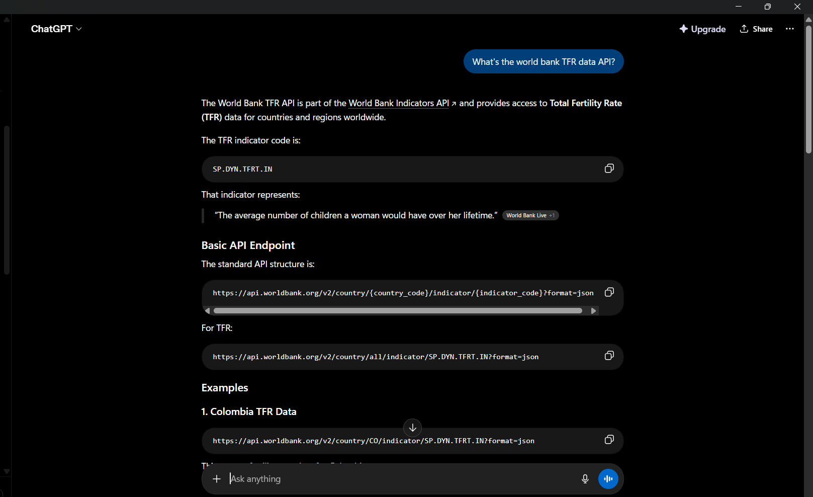
</p>

*World Bank TFR Data API Search.*
</details>

<details>
<summary><strong>❓ Questions Asked</strong></summary>  
<br><br>

<p align="left">
    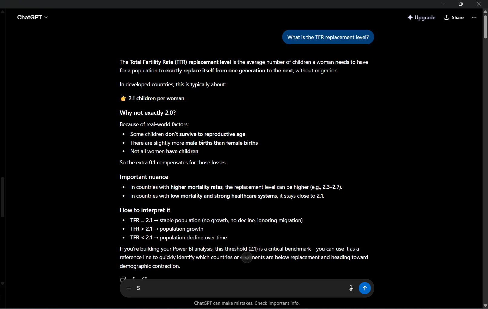
</p>

*Fertility Rate replacemnent level and related questions.*
</details>

<details>
<summary><strong>Ⓜ️ Markdown documentation translation</strong></summary>  
<br><br>

<p align="left">
    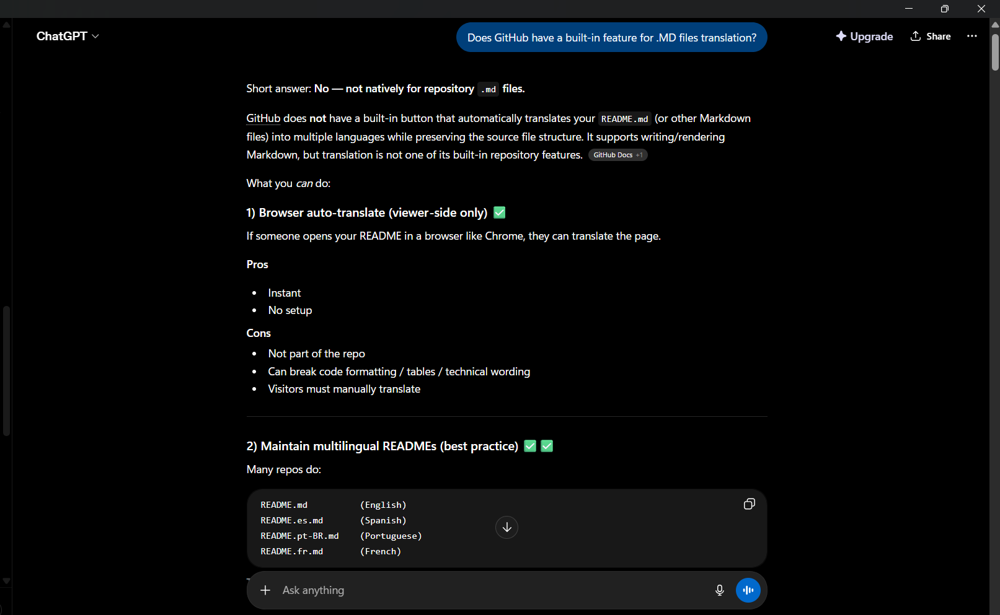
    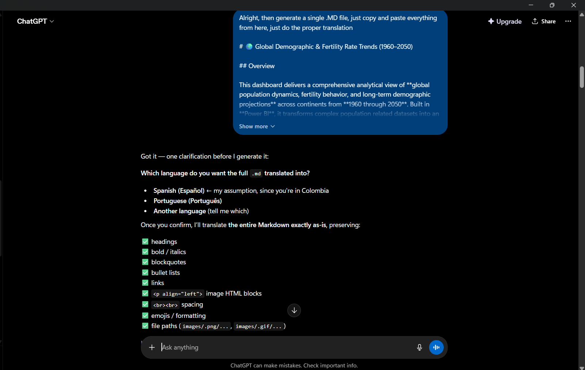
    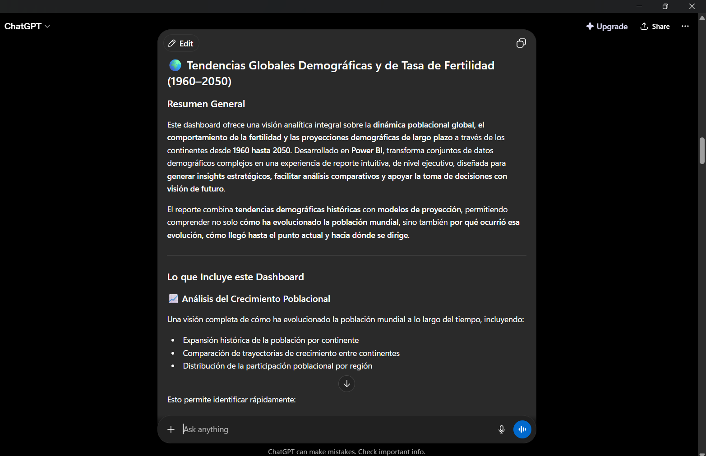
</p>

*Instead of manually recreating the entire Markdown documentation in Spanish, ChatGPT was utilized to accelerate the localization process by generating a translated version based on the original documentation. This significantly reduced the time required to produce multilingual project documentation while maintaining consistency in structure, formatting, and technical terminology across both versions.*
</details>

<details>
<summary><strong>🔠 Sentences restructuring</strong></summary>  
<br><br>

<p align="left">
    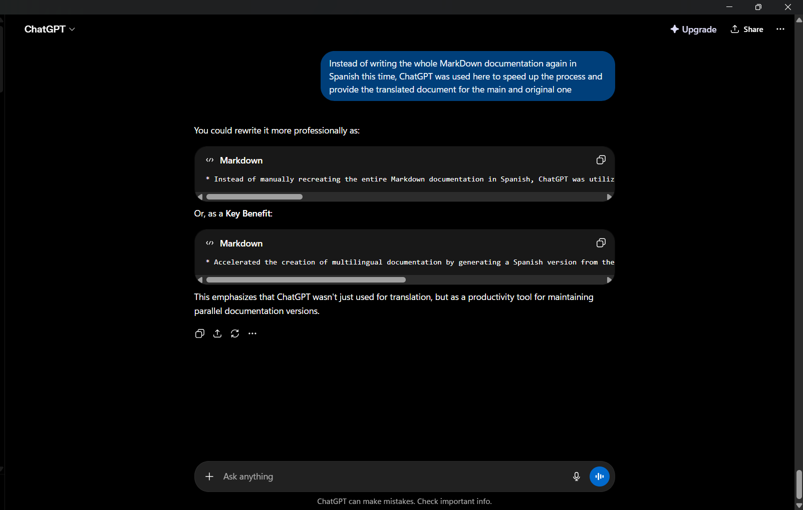
    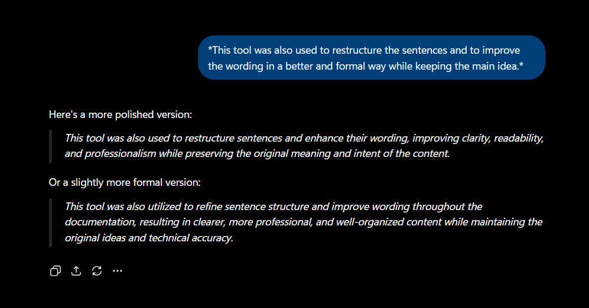
</p>

*This tool was also used to restructure sentences and enhance their wording, improving clarity, readability, and professionalism while preserving the original meaning and intent of the content.*
</details>

<br>

---

## 🎉 Final Notes

Thank you for making it this far.

By reaching this section, you have explored the project's documentation and gained insight into the technologies, tools, methodologies, and design decisions that were utilized throughout its development. I appreciate the time you invested in reviewing the project and learning about the purpose each component served in building this solution.  

Thank you once again for accompanying me throughout this journey.

<br>

> *"Technology is nothing. What's important is that you have faith in people, that they're basically good and smart, and if you give them tools, they'll do wonderful things with them."*
>
> **— Steve Jobs, Rolling Stone Interview**

